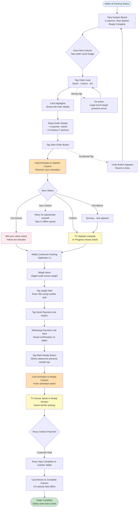
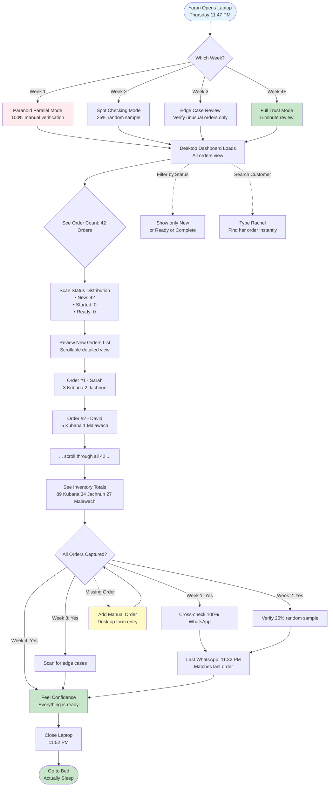

# UX Design Specification kitchenos

**Author:** Harel
**Date:** 2025-12-14

---

<!-- UX design content will be appended sequentially through collaborative workflow steps -->

## Executive Summary

### Project Vision

KitchenOS is a tablet-first Kitchen Display System that transforms food business operations by replacing chaotic paper tickets with a streamlined digital workflow. The system serves a **single-user type (order staff)** who manage the complete order lifecycle from WhatsApp receipt through customer handoff.

The core differentiator is **"Zero-Training Kitchen Operations"** - order staff can use the system effectively within 5 minutes without formal training. The system coordinates two displays: a private tablet for detailed order management and a public-facing TV for customer-visible status monitoring.

### Target Users

**Primary User: Order Staff**
- Manage complete order workflow from receipt to handoff
- Coordinate with kitchen staff verbally (kitchen staff don't interact with system)
- Handle price entry after cashier weighing
- Monitor multiple simultaneous orders at different stages
- Work in fast-paced environment with customers present
- Perform under customer observation (customers watch the public TV display)
- Clean hands environment (standard touch interaction)

**Secondary Stakeholder: Customers**
- View public TV display while waiting for orders
- Receive WhatsApp notifications for order status
- Should feel informed without seeing sensitive pricing/personal data
- Judge order staff competence through TV display responsiveness

**Non-Users: Kitchen Staff**
- Prepare food based on verbal coordination with order staff
- Do NOT interact directly with KitchenOS system

### Key Design Challenges

1. **Dual-Display Context Switching** - Order staff must work seamlessly between tablet (detailed controls) and TV (at-a-glance monitoring) without losing context or making errors during attention shifts.

2. **Perceived Competence Under Observation** - Order staff perform under customer scrutiny via the public TV display. Every tablet interaction is being mentally tracked by waiting customers. The UX must make order staff feel confident and look professional, even when juggling multiple simultaneous orders in a chaotic environment.

3. **Public-Facing Privacy Balance** - TV display must show enough information for customers to feel informed about order status while hiding sensitive details (prices, full customer names, private order information). Design must feel transparent without exposing private data.

4. **Revenue-Critical Price Entry Under Pressure** - Manual price entry happens while customers may be watching and waiting for WhatsApp notification. This is a revenue-critical transaction where errors could mean revenue loss or customer disputes. Speed pressure (customer waiting) conflicts with accuracy requirements. No undo once WhatsApp notification sent with price.

5. **Multi-Order Juggling** - Order staff manage multiple simultaneous orders at different workflow stages (new orders arriving while bagging completed ones, updating prices, coordinating with cashier). Interface must prevent confusion and mistakes.

6. **Offline Degradation Visibility** - System must gracefully handle offline scenarios when customers are watching the public TV display. Customers will notice if display freezes or shows stale data. Must communicate system state without alarming customers while order staff remain present to explain.

### Design Opportunities

1. **Zero-Cognitive-Load TV Display** - Create beautiful, professional public-facing display that builds customer trust and reduces "where's my order?" questions. Color-coded stages, smooth transitions, clear visual hierarchy that customers can understand at a glance.

2. **Choreographed Status Dance** - Design tablet-to-TV update pattern as theater that builds customer trust. When order staff tap actions on tablet (<100ms sync via Supabase Realtime), TV shows smooth, satisfying transitions that signal competence and control. Not just functional - building trust through motion design.

3. **Speed-Optimized Tablet Workflow** - Design rapid-fire interactions for focused order staff with clean hands: swipe gestures, quick-tap status changes, large numeric keypads for price entry, minimal cognitive overhead.

4. **Smart Defaults & Price Memory** - System learns typical price ranges for items. If order staff enters outlier price (e.g., 5 NIS for item usually 50 NIS), subtle visual flag prompts confirmation. Catches typos without slowing workflow. Shows WhatsApp preview before final send to prevent errors.

5. **Graceful Degradation Choreography** - TV elegantly indicates offline state with subtle indicator (not alarming) and smoothly recovers when connection returns. Turns potential failure into demonstration of system robustness while order staff remain present to explain to customers.

6. **Calm Technology Approach** - System fades into background during normal operations and only demands attention when needed (new order arrives, customer inquiry). Visual/audio cues that inform without overwhelming in busy environment.

## Core User Experience

### Defining Experience

**The Core Action Loop:**

The heart of KitchenOS is the **Order Status Update** - the single tap that advances an order through its lifecycle (New → Preparing → Ready → Paid). This action happens dozens of times per day and must feel instant, confident, and visually satisfying on both the tablet and TV display.

**What Makes It Work:**

- **Single-tap progression with emotional payoff** - Each status tap feels satisfying, like checking off a to-do item. Haptic feedback + visual confirmation create an instant "I'm in control" moment. Watching the TV update provides the dopamine hit of visible progress.
- **Optimistic UI with smart sync indicators** - Tablet shows immediate local update. TV receives update via Supabase Realtime (target: <100ms for seamless theater effect). Smart indicator pattern: no indicator for first 150ms, subtle shimmer at 150ms+, clear 'syncing' state at 500ms+. This keeps the theater intact 99% of the time while preventing "is this working?" anxiety.
- **Visual confidence under observation** - Each status change triggers smooth, satisfying animations that signal competence to watching customers.
- **Zero-training intuitiveness** - New order staff understand the flow within 5 minutes. The interface is self-evident.

The system succeeds when order staff stop thinking about "using the software" and simply flow through orders naturally.

### Platform Strategy

**Device Configuration:**

- **Tablet (iPad/Android)** - Primary interaction device for order staff
  - Portrait orientation (primary), landscape supported
  - Standard capacitive touch (clean hands environment)
  - Offline-first architecture with local data persistence
  - Optimistic UI updates for instant feedback

- **Desktop/TV Display (40-inch screen)** - Public-facing monitor for customer viewing
  - Read-only display (no interaction)
  - Browser-based via Next.js web app
  - Optimized for 2-3 meter viewing distance
  - Real-time sync with tablet via Supabase Realtime

**Network Resilience:**

- **Online mode:** Full functionality with real-time WhatsApp integration, tablet-TV sync, and cloud backup
- **Offline mode:** Tablet operates independently (no WhatsApp sync, no TV updates, no price notifications). All data stored locally and synced when connection returns.
- **Recovery:** Automatic sync with visual confirmation when internet returns. Order staff never worry about data loss.

**Performance Degradation Hierarchy:**

1. **Ideal (<100ms sync):** Seamless theater effect, no indicators - pure choreographed status dance
2. **Acceptable (100-300ms):** Tablet shows brief shimmer during sync, maintains flow
3. **Degraded (>300ms):** TV shows subtle 'updating...' indicator to manage expectations
4. **Offline:** Both displays show clear offline state with elegant recovery when connection returns

### Effortless Interactions

**Zero-Thought Actions with Emotional Design:**

1. **Status Progression** - Single tap advances order status with satisfying haptic + visual feedback. No confirmation dialogs. Natural forward flow with optional undo if needed. Each tap feels like progress, building confidence through micro-victories.

2. **Spatial Order Flow** - Orders flow like a game board: new orders slide in from the top, completed orders fade away gracefully. Order staff develop spatial memory: "Top-left is new, bottom-right is ready." Color-coding + position = instant situational awareness.

3. **Order Visibility at a Glance** - Both tablet and TV use color-coding + spatial layout to make current state instantly obvious: "Which orders are new? Which are being prepared? Which are ready?" Zero cognitive load.

4. **Price Entry with Safety** - Large numeric keypad for speed. Smart outlier detection flags unusual prices AS order staff type (e.g., 5 NIS instead of 50 NIS) with one-tap confirmation. WhatsApp preview shown before final send prevents embarrassing errors under customer observation.

5. **New Order Awareness** - Visual + subtle audio cue when WhatsApp order arrives. Informs without disrupting current workflow. Order staff never miss incoming orders but aren't constantly interrupted.

6. **Multi-Order Organization** - System automatically organizes orders by status and time. Order staff can glance and immediately understand: "3 new orders, 2 being prepared, 1 ready for pickup."

7. **Customer Inquiry Response** - Order staff glance at tablet OR point to TV to instantly answer "Where's my order?" with confidence. No searching, no uncertainty.

### Critical Success Moments

**Make-or-Break Interactions:**

1. **"First Order Processed" Moment** - New order staff member successfully processes first order within 5 minutes (zero-training promise). System makes them feel "I got this" rather than "This is confusing." Spatial layout + color-coding + single-tap actions create instant competence.

2. **"Customer Watching Price Entry" Moment** - Order staff enter price while customer may be standing nearby. Smart outlier detection + WhatsApp preview prevents errors and builds confidence under observation. The "check before you send" preview becomes a professional ritual.

3. **"Multi-Order Chaos Recovery" Moment** - 3-4 new orders arrive simultaneously while order staff are bagging another order. Spatial flow (new orders slide in smoothly) + visual organization + clear status hierarchy prevent panic and mistakes. Order staff feel organized, not overwhelmed.

4. **"Customer Asks 'Where's My Order?'" Moment** - Instant, confident response by glancing at tablet or pointing to TV. No searching, no uncertainty. The public TV turns potential interruptions into demonstrations of transparency.

5. **"System Comes Back Online" Moment** - After offline period, automatic sync with visual confirmation that "everything's backed up and synced." No data loss anxiety. The graceful recovery builds trust in system reliability.

6. **"TV Update Synchronization" Moment** - Tablet tap triggers TV update so fast (<100ms target) that watching customers perceive it as simultaneous. Smart indicator pattern (no indicator until 150ms) maintains the theater 99% of the time while preventing anxiety the other 1%.

7. **"First Customer Compliment" Moment** - When a customer says "Wow, I love that I can see the status!" or "This is so much better than calling to ask about my order" - order staff realize the TV isn't just for efficiency, it's a customer delight feature. This moment converts skeptical staff into system advocates.

**The Ultimate Success:** Order staff realize they haven't thought about "using the system" all day - they're just flowing through orders naturally. The system has become invisible.

### Experience Principles

**UX Decision-Making Framework:**

1. **"Instant Competence, Lasting Mastery"** - New order staff achieve proficiency within 5 minutes (zero-training promise), and the system continues to support efficiency as they become experts. No hidden features, no complex menus - everything obvious from first use.

2. **"Performance as Theater"** - Every tablet interaction is a performance for watching customers via the TV display. The <100ms sync creates a "choreographed status dance" that signals competence, control, and professionalism. Motion design builds trust. Smart indicator pattern maintains theater while preventing anxiety.

3. **"One Tap Forward, Never Back"** - Status progression is always a single, confident tap forward with satisfying haptic + visual feedback. No confirmation dialogs that slow workflow. Undo is available if needed, but the primary flow is frictionless advancement with micro-victories.

4. **"Calm Under Chaos"** - When multiple orders arrive simultaneously, the system organizes and prioritizes rather than overwhelming. Spatial flow (game board metaphor) + visual hierarchy + color-coding provide instant situational awareness without cognitive load.

5. **"Offline Resilience, Online Grace"** - System works fully when offline (tablet-only mode), then syncs gracefully when connection returns. Order staff never worry about data loss. Performance degradation hierarchy manages expectations without breaking flow.

6. **"Smart Safeguards, Not Roadblocks"** - Revenue-critical actions (price entry, order completion) include intelligent error prevention (outlier detection, WhatsApp preview) that catches mistakes without slowing down confident, accurate users. Safety becomes professional ritual, not friction.

7. **"Responsive Adaptation"** - Tablet works in portrait (primary) or landscape. 40-inch TV optimized for customer viewing distance (2-3 meters). System adapts to environment rather than forcing environment to adapt to system.
## Desired Emotional Response

### Primary Emotional Goals

**Confident Competence Under Observation**

The paramount emotional goal for KitchenOS is making order staff feel professionally capable and in control, especially when customers are watching via the public TV display. The system transforms order management from chaotic paper-shuffling into a choreographed performance of competence.

Order staff should feel:
- **"I'm in control"** - Every interaction confirms their mastery, not their confusion
- **"I look professional"** - The tablet-to-TV synchronization makes them appear skilled and organized to watching customers
- **"The system has my back"** - Smart safeguards prevent embarrassing mistakes before they reach customers

This emotional foundation differentiates KitchenOS from paper chaos and generic POS systems that make order staff feel like they're fighting the technology rather than leveraging it.

### Emotional Journey Mapping

**1. First Discovery/Onboarding (0-5 minutes)**
- **Emotional Transition:** Skepticism → Confidence
- **Target Feeling:** "This makes sense"
- **Design Support:** Zero-training intuitiveness through spatial game board layout, color-coded stages, self-evident workflow
- **Success Indicator:** Order staff process first order within 5 minutes without instruction
- **Validation Metric:** Time-to-first-order-completion <5 min = confident; Error rate during first hour (low = confident, high = confused)

**2. During Core Experience (Throughout Daily Use)**
- **Target Feeling:** "I'm on top of this" (control, flow state)
- **Design Support:** Spatial memory development (top-left = new, bottom-right = ready), auto-organization by status + time, micro-victory feedback via haptic + visual confirmations
- **Success Indicator:** Order staff enter flow state, system becomes invisible to conscious thought
- **Validation Metric:** Feature discovery rate without documentation; Usage rate during peak hours (high = trust in system)

**3. After Task Completion (Order Fully Processed)**
- **Target Feeling:** "That was smooth" (professional accomplishment)
- **Design Support:** Orders fade away gracefully with satisfying animation, customer receives WhatsApp notification, visual closure through completion animations
- **Success Indicator:** Pride in the choreographed performance customers witnessed
- **Validation Metric:** Customer wait time for status inquiry (<5 sec = competent response)

**4. When Something Goes Wrong (Errors, Offline, Rush)**
- **Target Feeling:** "The system has my back" (trust, not panic)
- **Design Support:** Smart price outlier detection, graceful offline degradation, sync recovery confirmation, optional undo for mistakes
- **Success Indicator:** Order staff remain calm, trust system to prevent customer-facing errors
- **Validation Metric:** Price outlier warnings acceptance rate (high = relief); Offline recovery completion rate (100% = trust)

**5. Returning Daily Use (Coming Back to Work)**
- **Target Feeling:** "Ready to flow" (familiarity, confidence)
- **Design Support:** Consistent spatial layout, muscle memory from repeated interactions, system invisibility
- **Success Indicator:** Order staff start using system immediately without mental preparation
- **Validation Metric:** Time to first productive action on return (<30 seconds = mastery)

### Micro-Emotions

**Critical Emotional States:**

**1. Confidence vs. Confusion**
- **Priority:** CRITICAL
- **Target:** Eliminate confusion from first 5 minutes onward
- **Design Approach:** Self-evident layouts, zero-training interface, single-tap actions without multi-step complexity
- **Measure:** 5-minute proficiency achievement
- **Validation Proxy:** Time-to-first-order-completion; Error rate during first hour; Feature discovery without docs

**2. Trust vs. Skepticism**
- **Priority:** CRITICAL
- **Target:** Order staff trust system won't make them look bad in front of customers
- **Design Approach:** Offline recovery, smart price detection, sync reliability, WhatsApp preview before send
- **Measure:** Willingness to use system during rush periods with customers watching
- **Validation Proxy:** Usage rate during peak hours; Offline recovery completion rate; Price entry verification behavior

**3. Relief vs. Anxiety**
- **Priority:** CRITICAL FOR TRUST-BUILDING
- **Target:** System prevents mistakes BEFORE they happen, creating relief instead of anxiety
- **Relief Moments:**
  - Price outlier detection catches "5" instead of "50" → "Phew, that would have been bad"
  - Offline mode gracefully handles network drop → "I can keep working"
  - WhatsApp preview shows exactly what customer will see → "No surprises"
- **Design Approach:** Preventive safeguards that feel like professional support, not intrusive nannying
- **Validation Proxy:** Number of outlier warnings accepted vs. ignored (high acceptance = relief); Time spent reviewing WhatsApp preview (optimal range = relief, too long = anxiety)

**4. Accomplishment vs. Frustration**
- **Priority:** CRITICAL
- **Target:** Each order completion feels like a win, not "finally, next task"
- **Design Approach:** Haptic feedback + visual confirmations = micro-victories throughout the day, orders fade away with satisfaction
- **Measure:** Order staff describe work as "satisfying" rather than "exhausting"
- **Validation Proxy:** Completion gesture patterns (smooth vs. hesitant taps); Return usage rate (high = satisfying)

**5. Pride vs. Embarrassment**
- **Priority:** UNIQUE TO PUBLIC-FACING SYSTEM
- **Target:** Order staff feel proud when customers compliment the system
- **Design Approach:** Choreographed tablet-to-TV sync (<100ms theater effect), smart safeguards prevent price entry mistakes before customer notification
- **Measure:** "First Customer Compliment" moment converts skeptical staff into system advocates
- **Validation Proxy:** Customer compliment rate (track via feedback); Customer perception of sync speed ("Did you notice delay?" surveys)

**6. Calm vs. Anxiety**
- **Priority:** CRITICAL FOR CHAOS MANAGEMENT
- **Target:** When 4 orders arrive at once, system creates calm through organization
- **Design Approach:** Spatial flow (game board), visual hierarchy, auto-prioritization, subtle (not alarming) audio cues
- **Measure:** Order staff can handle simultaneous order rush without stress escalation
- **Validation Proxy:** Multi-order handling success rate; Time to respond to new orders during rush

**7. Delight vs. Satisfaction**
- **Priority:** ADVOCACY ACCELERATOR
- **Target:** Unexpected moments of joy that make order staff say "I love this system"
- **Delight Moments:**
  - Orders fade away with satisfying animation when complete (visual reward)
  - System auto-suggests prices based on similar previous orders (intelligent assistance)
  - Subtle celebration animation on TV after particularly busy rush period ends (acknowledgment of hard work)
- **Design Approach:** Small unexpected touches that create joy without being necessary for function
- **Measure:** Word-of-mouth advocacy; Emotional attachment to system
- **Validation Proxy:** Customer compliment mentions during surveys; Staff resistance to switching systems

**8. Competence vs. Incompetence**
- **Priority:** THE DIFFERENTIATOR
- **Target:** "Performance as Theater" turns order management into professional competence demonstration
- **Design Approach:** Order staff look skilled, organized, modern to watching customers through smooth animations and instant sync
- **Measure:** Customers comment on professionalism and organization
- **Validation Proxy:** Observable competence indicators - customer wait time for inquiry (<5 sec); Tablet-to-TV sync perceived as simultaneous (customer surveys); Customer compliment rate

### Design Implications

**Emotion-to-UX Connection Matrix:**

**1. Confidence → Zero-Training Intuitiveness**
- Spatial game board layout = instant understanding without instruction
- Color-coded status stages = self-evident workflow
- Single-tap progression = no confusing multi-step processes
- **Implementation:** Onboarding consists of processing one order with system, not reading documentation

**2. Trust → Smart Safeguards**
- Outlier price detection = system prevents revenue mistakes before they reach customers
- WhatsApp preview before send = "check before you commit" ritual
- Graceful offline recovery = "your data is safe" confirmation
- **Implementation:** Safety feels like professional ritual, not friction

**3. Relief → Preventive Protection**
- Price outlier flags AS order staff type (not after submission)
- Offline mode notification appears BEFORE data loss risk
- WhatsApp preview shows EXACTLY what customer sees before send
- **Implementation:** System catches mistakes at the moment of creation, preventing anxiety cascade

**4. Accomplishment → Micro-Victory Feedback**
- Haptic feedback on each status tap = tactile satisfaction
- Smooth animations on TV = visible progress customers can see
- Orders fade away when complete = visual closure
- **Implementation:** Every interaction provides instant positive reinforcement

**5. Pride → Performance as Theater**
- <100ms tablet-to-TV sync = looks professional to customers
- Smooth transitions = choreographed competence demonstration
- Customer compliments = validation that converts skeptical staff to advocates
- **Implementation:** Motion design isn't decoration, it's trust-building theater

**6. Calm → Visual Organization**
- Spatial memory (top-left = new, bottom-right = ready) reduces cognitive load
- Auto-organization by status + time eliminates manual sorting
- Subtle audio cues inform without alarming
- **Implementation:** System organizes chaos rather than adding to it

**7. Delight → Surprise Moments**
- Satisfying fade-out animation when order completes (visual reward for completion)
- Auto-suggested prices for similar items (intelligent assistance that saves time)
- Celebration animation after rush period ends (system acknowledges hard work)
- **Implementation:** Delight moments accelerate advocacy but aren't MVP-critical; implement post-foundation

**8. Competence → Professional Rituals**
- Price entry with preview becomes practiced routine that builds confidence
- Pointing to TV to answer "where's my order?" = expert gesture
- Flow state from repeated micro-victories = invisibility of mastery
- **Implementation:** Repeated actions build muscle memory and professional identity

### Emotional Design Principles

**Guiding Framework for Emotional UX Decisions:**

**1. "Perform with Confidence"**
Every design decision must answer: "Does this make order staff look and feel competent when customers are watching?" The public TV display turns every interaction into a performance. Smooth, instant visual feedback = professional theater.

**2. "Trust Through Transparency"**
Build trust by showing (not hiding) system state. Offline indicators, sync shimmers, price previews - all visible but non-alarming. Order staff trust what they can see and verify.

**3. "Relief Before Anxiety"**
Prevent mistakes at the moment of creation, not after submission. Price outliers flagged AS typing, not after send. Offline warnings BEFORE data loss risk. Preview BEFORE customer sees it. Relief comes from early prevention.

**4. "Micro-Victories Build Flow"**
Design for dopamine hits throughout the day. Haptic feedback, smooth animations, visual completions - each small win builds toward flow state where the system becomes invisible.

**5. "Prevent, Don't Punish"**
Smart safeguards (outlier detection, WhatsApp preview) prevent mistakes BEFORE they reach customers. Safety feels like professional ritual, not roadblock. Never embarrass users.

**6. "Calm Comes from Clarity"**
Visual organization defeats chaos. Spatial layout, color-coding, auto-prioritization - instant situational awareness without cognitive load. Order staff should glance and know everything.

**7. "Pride Through Customer Delight"**
The "First Customer Compliment" moment is the emotional tipping point. When customers praise the system, order staff realize they're not just using software - they're delivering a better customer experience.

**8. "Delight Builds Advocacy"**
Unexpected moments of joy (satisfying animations, intelligent suggestions, celebration after rush) transform "this works" into "I love this." Delight isn't MVP-critical but accelerates word-of-mouth.

**9. "Invisibility is Mastery"**
The ultimate emotional success: order staff forget they're using a system. Flow state, muscle memory, professional rituals - technology fades as competence emerges.

**10. "Measure What Matters"**
Emotional goals must be validated through behavioral proxies: time-to-competence, error rates, peak-hour usage, compliment tracking, outlier acceptance rates. What gets measured gets improved.

## UX Pattern Analysis & Inspiration

### Inspiring Products Analysis

We analyzed three products the order staff already know and love: Notion (Kanban dashboard), WhatsApp, and Slack. None of these are POS systems - which aligns perfectly with KitchenOS's goal of feeling familiar, not like "restaurant software."

**Notion Kanban Dashboard:**
- **Core Strength:** Visual organization across states - you see EVERYTHING at once, no menus to dig through
- **Navigation:** Horizontal columns = states; cards show key info, expand for details; drag-and-drop feels physical
- **Visual Design:** Whitespace prevents overwhelm; subtle shadows create card boundaries; typography hierarchy enables scanning
- **Key Lesson:** Spatial status visualization - each order status is a PLACE on screen, not a dropdown value

**WhatsApp:**
- **Core Strength:** Message delivery confidence via simple status icons (✓, ✓✓, blue ✓✓); real-time sync that "just works"
- **Navigation:** Two-level hierarchy maximum (conversation list → thread); never more than 1 tap to critical content
- **Visual Design:** Minimal chrome (content = 90%, UI = 10%); green = trust/reliability; position communicates sender identity
- **Error Handling:** Transparent about state (clock = sending, red ! = failed, "Connecting..." banner when offline)
- **Key Lesson:** Status indicators over text - icons/colors communicate faster than reading words

**Slack:**
- **Core Strength:** Channel organization prevents chaos; unread management (bold = needs attention, gray = done)
- **Navigation:** Sidebar overview + focused channel view; "jump to unread" for efficient catch-up
- **Visual Design:** Attention-driven contrast (purple for active, gray for read); thread indent creates hierarchy without nesting
- **Error Handling:** "Viewing offline messages" banner; optimistic sending with retry; edit history for transparency
- **Key Lesson:** Attention-driven contrast - new/active items SCREAM visually, completed items fade

### Transferable UX Patterns

**Navigation Patterns:**
1. **Spatial Column Organization (from Notion)** - Status flow as visual PLACES: New → Started → Ready → Complete. Moving right = progress. Fits "understand status by a glance" perfectly.
2. **Two-Level Information Architecture (from WhatsApp)** - Level 1: All orders overview (board view); Level 2: Single order details (expanded card). Never 3+ levels deep.

**Interaction Patterns:**
1. **Status Indicators Over Text (from WhatsApp)** - Icons/colors instead of "Order Status: Started." Use ⏱️ (waiting), 🔥 (cooking), ✅ (ready), 📦 (complete) with color-coding.
2. **Optimistic UI with Sync Indicators (from WhatsApp + Slack)** - Update tablet immediately, show sync status (✓ = synced, ⏳ = syncing, ⚠️ = offline). Aligns with 100ms tablet-to-TV sync target.
3. **One-Tap Primary Actions (from WhatsApp)** - "Start Order" button = one tap, done. "Mark Ready" = one tap, done. Price entry as ONLY multi-step action (revenue-critical, deserves focus).
4. **Tap-to-Advance (adapted from Notion)** - Notion's drag-and-drop won't work well on portrait tablet. Replace with prominent action buttons on each card.

**Visual Patterns:**
1. **Card Density Control (from Notion)** - Compact view (3+ orders): order ID, first name, item count, time. Expanded view (tap card): full details. Adapts to volume.
2. **Minimal Chrome, Maximum Content (from WhatsApp)** - Orders occupy 90% of screen, UI chrome is 10%. Critical for portrait tablet orientation.
3. **Color-Coded Status States (from all three)** - Gray (new/waiting) → Blue (started/in progress) → Orange (ready/needs attention) → Green (complete/can fade).

### Anti-Patterns to Avoid

1. **Hidden Status** - Don't bury order status behind dropdowns or tabs. User needs to "understand the status overall and of each order by a glance" - status must be VISIBLE, not queried.
2. **Ambiguous Sync State** - Never leave user wondering "did the TV update?" Always show sync status, even if subtle. Avoid WhatsApp's "did my message send?" anxiety.
3. **Deep Menu Hierarchies** - Slack's thread model works for conversations, not orders. Don't nest order details 3+ levels deep. Everything critical should be 1-2 taps maximum.
4. **Overwhelming Notifications** - Slack can become notification hell. For single-user KitchenOS: NO push notifications. Visual state changes on screen are sufficient.
5. **Drag-and-Drop on Small Screens** - Notion Kanban needs space for drag gestures. Portrait tablet too narrow for reliable column-based drag. Use tap-to-advance instead.
6. **Text-Heavy Status Communication** - Don't write "Order Status: Started at 2:35 PM, Elapsed Time: 5 minutes." Use blue card + 🔥 icon + "5m" badge. Faster to scan, works under observation pressure.

### Design Inspiration Strategy

**What to Adopt:**
- **Notion's Spatial Column Metaphor** - 4 columns (New, Started, Ready, Complete) on tablet; simplified 2-state view on TV (In Progress, Ready). Aligns with "glance to understand status" requirement.
- **WhatsApp's Status Indicator System** - Icons/colors communicate faster than text; builds trust through transparency. Implement subtle sync icons on each card, color-coded status states.
- **Minimal Chrome Philosophy (WhatsApp)** - Portrait tablet has limited real estate; under observation requires zero cognitive load. Full-screen order board, minimal navigation UI.

**What to Adapt:**
- **Notion's Drag-and-Drop → Tap-to-Advance** - Portrait tablet constraints + speed under pressure. Use prominent "Start" / "Mark Ready" / "Complete" buttons on each card instead of drag gestures.
- **Slack's Sidebar → Filter Pills (if needed)** - Single-user context (no channels), small order volume. Skip sidebar entirely for MVP; add simple filter pills later if volume increases.
- **WhatsApp's Message Preview → Order Summary Cards** - Adapt for order context with privacy on public TV. Card shows customer first name, item count, elapsed time (no prices, no full names).

**What to Avoid:**
- **Notion's Heavy Customization UI** - Conflicts with zero-training goal and single-user, small volume context. Use fixed, opinionated UX that "just works" instead.
- **Slack's Complex Thread Model** - Orders aren't threaded conversations. Use flat order list with simple expand/collapse, not nested threads (violates two-tap maximum rule).
- **WhatsApp's Conversation History UI** - Orders are ephemeral (complete and forget), no need to scroll back through yesterday. Auto-archive completed orders after X hours, focus on TODAY.

**Core Strategy:** Notion's spatial columns + WhatsApp's status indicators + minimal chrome = KitchenOS order board. Familiar patterns from apps order staff already love, adapted for kitchen operations context.

## Design System Foundation

### Design System Choice

**shadcn/ui** (Radix UI primitives + Tailwind CSS)

shadcn/ui is a collection of re-usable components built using Radix UI primitives and styled with Tailwind CSS. Unlike traditional component libraries, shadcn/ui components are copied directly into your codebase, giving you full ownership and control.

**Key Characteristics:**
- **Not a library dependency** - Components live in your codebase (`/components/ui/`), you own them
- **Built on Radix UI** - Accessible, unstyled primitives following WAI-ARIA standards
- **Styled with Tailwind CSS** - Utility-first CSS framework for rapid styling
- **Fully customizable** - Modify components directly without fighting theme overrides
- **TypeScript-first** - Excellent type safety and developer experience
- **Performance-optimized** - Minimal bundle size (~8KB base vs ~60KB for Ant Design), tree-shakeable components

### Rationale for Selection

**1. Complete Control for Custom UX Patterns (Sally's UX Perspective)**

KitchenOS requires highly specific interaction patterns that don't exist in standard component libraries:
- Custom kanban-style order board with spatial column layout
- Tablet-optimized order cards with density control (compact vs. expanded)
- Real-time sync indicators (✓, ⏳, ⚠️) integrated into components
- Color-coded status states (gray → blue → orange → green)
- Large touch-optimized numeric keypad for price entry
- **Emotional design integration:** Haptic feedback on status taps, satisfying animations for "Performance as Theater," micro-interaction polish baked into components

With shadcn/ui, custom components are built by extending base primitives (Card, Button, Input) without fighting library constraints. You own the code, so adaptations for emotional design are straightforward.

**Accessibility Foundation:** Radix UI primitives provide keyboard navigation, screen reader support, and focus management out-of-box. Order staff with visual impairments can navigate the board via keyboard without custom ARIA implementation.

**2. Performance-Critical <100ms Sync Requirement (Winston's Architecture Analysis)**

The "choreographed status dance" requires minimal overhead:
- **Lightweight components** - Only include what you use, no unused library code
- **Tree-shakeable** - Bundle only imports the components you actually need (~8KB base vs ~60KB for Ant Design)
- **No runtime styling overhead** - Tailwind generates static CSS at build time, no CSS-in-JS runtime cost
- **Optimistic UI support** - Full control over component state enables immediate local updates before server confirmation

This aligns with your Supabase Realtime sync target of <100ms tablet-to-TV synchronization.

**Maintenance Trade-Off:** You own component maintenance. When Radix UI releases breaking changes, you'll manually update copied components. Not impossible, but factor into total cost of ownership.

**3. Developer Productivity & Rapid MVP Timeline (Barry's Implementation Roadmap)**

For your small team, shadcn's copy-paste model accelerates development:

**Speed-to-First-Pixel:**
```bash
npx shadcn-ui@latest init  # 2 minutes
npx shadcn-ui@latest add button card input badge  # 30 seconds
# Coding components in 3 minutes flat
```

**3-Week MVP UI Timeline:**
- **Week 1: Core Components**
  - `OrderCard` - Extends shadcn `Card` with status colors, sync indicators, density modes
  - `StatusButton` - Extends shadcn `Button` with haptic feedback integration
  - `PriceInput` - Large numeric keypad with outlier detection visual feedback

- **Week 2: Layout Components**
  - `OrderBoard` - Custom kanban layout with spatial columns
  - `TVOrderDisplay` - Public-facing read-only view (no prices, first names only)
  - `OrderSearch` - Quick filter for multi-order scenarios

- **Week 3: Polish & Micro-Interactions**
  - Animations (fade-out on completion, shimmer on sync)
  - `SyncIndicator` - Real-time connection status component
  - Haptic feedback integration for status progression

**4. Tablet-First Responsive Design**

Portrait tablet (primary) + landscape support requires precise responsive control:
- **Tailwind's responsive utilities** - `md:`, `lg:` prefixes make portrait/landscape adaptation trivial
- **Touch-optimized by default** - Components scale well for tablet touch targets
- **Minimal chrome philosophy** - shadcn components are unstyled by default, enabling WhatsApp-inspired minimal UI (90% content, 10% chrome)

**5. Component Ownership Philosophy (Team Consensus)**

**Sally's Take:** "We're not theming someone else's button, we're building THE KitchenOS status button with theater built-in."

**Winston's Take:** "When Sally sketches a custom order card, Barry builds it in your codebase directly. That's architectural agility."

**Barry's Take:** "When you need to add haptic feedback to status buttons, you just edit `components/ui/button.tsx`. No HOC wrappers, no theme override hell, just code."

### Implementation Approach

**1. Initial Setup (Day 1)**

```bash
# Initialize Next.js 16 project with TypeScript
npx create-next-app@latest kitchenos --typescript --tailwind --app

# Initialize shadcn/ui
npx shadcn-ui@latest init

# Add initial components
npx shadcn-ui@latest add button card input badge
```

**2. Design Token Configuration**

Define KitchenOS color palette in `tailwind.config.ts`:

```typescript
// Status color system aligned with emotional design
colors: {
  status: {
    new: 'hsl(0 0% 60%)',        // Gray - waiting (neutral, calm)
    started: 'hsl(217 91% 60%)',  // Blue - in progress (active, confident)
    ready: 'hsl(25 95% 53%)',     // Orange - needs attention (energetic, urgent)
    complete: 'hsl(142 71% 45%)', // Green - done (accomplishment, relief)
  },
  sync: {
    synced: 'hsl(142 71% 45%)',   // ✓ green (trust, reliability)
    syncing: 'hsl(45 93% 47%)',   // ⏳ yellow (transparency, in-progress)
    offline: 'hsl(0 84% 60%)',    // ⚠️ red (alert, graceful degradation)
  }
}
```

**3. Component Conventions (Winston's Recommendations)**

To prevent Tailwind verbosity and ensure maintainability:

**Extract Reusable Patterns:**
```css
/* /app/globals.css */
@layer components {
  .order-card-base {
    @apply rounded-lg border bg-card text-card-foreground shadow-sm p-4;
  }

  .touch-target {
    @apply min-h-[44px] min-w-[44px]; /* Tablet-optimized touch targets */
  }

  .status-badge {
    @apply inline-flex items-center rounded-full px-3 py-1 text-xs font-medium;
  }
}
```

**Document Component APIs:**
```typescript
// /components/ui/order-card.tsx
export interface OrderCardProps {
  order: Order
  onStatusChange: (orderId: string) => void
  density?: 'compact' | 'expanded' // Card density control
  syncStatus?: 'synced' | 'syncing' | 'offline' // Sync indicator
}
```

**Version Control:**
Treat `/components/ui/` like library code - version in git, document changes, review modifications carefully.

**4. Custom Component Development Examples**

**OrderCard with Emotional Design:**
```typescript
// /components/ui/order-card.tsx
export function OrderCard({ order, onStatusChange, density = 'compact', syncStatus = 'synced' }: OrderCardProps) {
  const handleStatusTap = () => {
    // Haptic feedback for tactile satisfaction (micro-victory)
    if ('vibrate' in navigator) {
      navigator.vibrate(50)
    }
    onStatusChange(order.id)
  }

  return (
    <Card className={cn(
      "order-card-base transition-all duration-200",
      statusColors[order.status], // Color-coded status states
      syncStatus === 'syncing' && "animate-shimmer", // Smart sync indicator
      density === 'compact' ? "p-3" : "p-4"
    )}>
      <CardHeader>
        <div className="flex items-center justify-between">
          <CardTitle className="text-base md:text-lg">
            {order.customerFirstName} {/* Privacy: first name only */}
          </CardTitle>
          <SyncIndicator status={syncStatus} />
        </div>
      </CardHeader>
      <CardContent className={density === 'compact' ? "text-sm" : "text-base"}>
        <div className="flex justify-between">
          <span className="text-muted-foreground tabular-nums">
            {order.itemCount} items
          </span>
          <TimeElapsed startTime={order.startedAt} />
        </div>
      </CardContent>
      <CardFooter>
        <Button
          onClick={handleStatusTap}
          className="w-full touch-target"
        >
          {getNextStatusLabel(order.status)}
        </Button>
      </CardFooter>
    </Card>
  )
}
```

**TVOrderDisplay (Public-Facing, Privacy-Safe):**
```typescript
// /components/tv-order-card.tsx
export function TVOrderCard({ order }: TVOrderCardProps) {
  return (
    <Card className="text-3xl p-6"> {/* Larger for 2-3m viewing distance */}
      <CardHeader>
        <CardTitle>{order.customerFirstName}</CardTitle> {/* First name only - no full names */}
        {/* NO PRICE DISPLAY - privacy requirement for public TV */}
      </CardHeader>
      <CardContent>
        <StatusBadge status={order.status} size="large" />
        <TimeElapsed startTime={order.startedAt} className="text-2xl" />
      </CardContent>
    </Card>
  )
}
```

**5. Accessibility Strategy (Sally's Foundation)**

Leverage Radix UI's built-in accessibility:
- **Keyboard navigation** - Tab through order cards, Enter to advance status
- **Screen reader announcements** - Status changes announced for visually impaired staff (e.g., "Order 42 moved to Ready")
- **Focus management** - Clear focus indicators for keyboard-only operation
- **ARIA attributes** - Radix primitives include proper roles, states, and properties automatically

**6. Performance Optimization (Winston's Architecture)**

- **Code splitting** - Next.js App Router automatic code splitting per route
- **Tree shaking** - Only bundle components actually imported
- **CSS optimization** - Tailwind purges unused classes in production build (`npm run build`)
- **Lazy loading** - Load TV display components only when needed:
  ```typescript
  const TVDisplay = lazy(() => import('@/components/tv-display'))
  ```

### Customization Strategy

**1. Offline-First Sync Integration**

Modify components to show sync state transparently (Trust Through Transparency principle):

```typescript
// Optimistic UI with sync indicator
const [localStatus, setLocalStatus] = useState(order.status)
const [syncStatus, setSyncStatus] = useState<'synced' | 'syncing' | 'offline'>('synced')

const handleStatusChange = async () => {
  // Immediate local update (optimistic UI for instant feedback)
  setLocalStatus(nextStatus)
  setSyncStatus('syncing')

  try {
    // Sync to Supabase Realtime
    await updateOrderStatus(order.id, nextStatus)
    setSyncStatus('synced')
  } catch (error) {
    setSyncStatus('offline') // Will retry when connection returns
  }
}
```

**2. Design Token Consistency**

Define reusable spacing, typography, and color tokens:

```typescript
// /lib/design-tokens.ts
export const spacing = {
  touchTarget: '44px', // Minimum touch target size for tablets
  cardGap: 'gap-3 md:gap-4',
  sectionGap: 'gap-6 md:gap-8',
}

export const typography = {
  orderID: 'text-xs font-mono text-muted-foreground',
  customerName: 'text-base md:text-lg font-semibold',
  timeElapsed: 'text-sm text-muted-foreground tabular-nums',
}

export const statusColors = {
  new: 'bg-gray-100 text-gray-800 border-gray-200',
  started: 'bg-blue-100 text-blue-800 border-blue-200',
  ready: 'bg-orange-100 text-orange-800 border-orange-200',
  complete: 'bg-green-100 text-green-800 border-green-200',
}
```

**3. Responsive Adaptation (Portrait Primary, Landscape Supported)**

Tablet-specific customizations using Tailwind responsive utilities:

```tsx
// Compact view (portrait) vs. expanded view (landscape)
<OrderCard className="
  p-3 md:p-4
  text-sm md:text-base
  grid grid-cols-1 md:grid-cols-2
" />

// Portrait-optimized kanban board
<div className="
  flex flex-col md:flex-row
  gap-4 md:gap-6
  overflow-y-auto md:overflow-x-auto
">
  {/* Status columns */}
</div>
```

**4. Animation & Motion Design (Performance as Theater)**

Add micro-interactions directly to components:

```typescript
// Satisfying fade-out animation when order completes
<motion.div
  initial={{ opacity: 1, scale: 1 }}
  exit={{ opacity: 0, scale: 0.95 }}
  transition={{ duration: 0.3, ease: 'easeOut' }}
>
  <OrderCard order={completedOrder} />
</motion.div>

// Shimmer animation for syncing state
// /app/globals.css
@keyframes shimmer {
  0% { background-position: -200% center; }
  100% { background-position: 200% center; }
}

.animate-shimmer {
  background: linear-gradient(90deg,
    transparent 0%,
    rgba(255,255,255,0.3) 50%,
    transparent 100%
  );
  background-size: 200% 100%;
  animation: shimmer 1.5s infinite;
}
```

**5. Component Extraction Discipline (Sally's Concern Addressed)**

To prevent Tailwind verbosity:

**Before (verbose):**
```tsx
<button className="inline-flex items-center justify-center rounded-md text-sm font-medium ring-offset-background transition-colors focus-visible:outline-none focus-visible:ring-2 focus-visible:ring-ring focus-visible:ring-offset-2 disabled:pointer-events-none disabled:opacity-50 bg-primary text-primary-foreground hover:bg-primary/90 h-10 px-4 py-2 min-h-[44px] min-w-[44px]">
  Start Order
</button>
```

**After (disciplined extraction):**
```tsx
// Component with extracted pattern
<StatusButton onClick={handleStart}>
  Start Order
</StatusButton>

// /components/ui/status-button.tsx
export function StatusButton({ children, ...props }: StatusButtonProps) {
  return (
    <Button className="touch-target" {...props}>
      {children}
    </Button>
  )
}
```

## Design Direction Decision

### Design Directions Explored

We explored 2 primary visual directions for KitchenOS through interactive prototypes (see `docs/ux-design-directions.html`):

**Direction 1: Classic Kanban Theater**
- Notion-inspired spatial columns with immersive color-coding
- Each order status occupies a fixed PLACE on screen (New → Started → Ready → Complete)
- Horizontal scroll flow with color-coded cards
- Full visual immersion with status-specific backgrounds
- Synchronized tablet-to-TV choreography

**Direction 5: Adaptive Hybrid Layout**
- Combined kanban spatial memory with list efficiency
- Volume-aware adaptation (compact horizontal for New orders, expanded vertical for Started/Ready)
- Context-sensitive design that changes based on order count
- Maximum space efficiency for portrait tablets
- Intelligent density scaling

### Chosen Direction

**Direction 1: Classic Kanban Theater** - Full spatial kanban with horizontal column flow.

**Key Design Decisions:**

**Layout:** 
- Horizontal kanban with 4 columns (New, Started, Ready, Complete)
- Column width: 280px (normal density) with responsive adjustments for compact (240px) and spacious (320px) modes
- Horizontal scroll with snap points for smooth navigation
- Fixed column positions create spatial consistency

**Visual Treatment:**
- Full color immersion - each card has status-specific background tint
- Border color reinforcement (2px borders matching status colors)
- Pulse animation on Ready cards (visual urgency indicator)
- Sync indicators with green dot (synced state)
- Top-border accent on hover for tactile feedback

**Information Hierarchy:**
1. Customer name (primary, 0.938rem, bold)
2. Time elapsed (monospace, right-aligned for scanability)
3. Item count (secondary, muted)
4. Action button (44px touch target, full-width)

**Interaction Pattern:**
- Tap entire card OR tap action button to advance status
- Shimmer animation during sync (visual confirmation of tablet-to-TV update)
- Smooth status transitions with card relocation animation
- Column count badges update in real-time

**TV Display Integration:**
- 2-column layout (In Progress | Ready)
- Large typography (2rem customer names, 1.5rem times)
- Dark background (hsl(0 0% 8%)) for customer-facing display
- 3px status-colored borders for at-a-glance recognition
- Synchronized in <100ms for performance theater effect

### Design Rationale

**Why Classic Kanban Theater Works for KitchenOS:**

1. **Spatial Memory = Zero Training**
   - After 2-3 orders, staff develop unconscious muscle memory
   - "New orders are on the left, Ready is third from left"
   - No need to read labels - position itself conveys meaning
   - Reduces cognitive load during high-pressure rush periods

2. **Horizontal Flow Matches Mental Model**
   - Left-to-right = "progress" in Western cultures
   - Natural scanning direction follows order lifecycle
   - Matches how humans think about task progression
   - Creates intuitive "where should I look next?" answers

3. **Visible Performance Theater**
   - Color-coded columns visible from across the kitchen
   - Tablet-to-TV sync creates "choreographed competence" effect
   - Staff feel like pros when their tap instantly updates the TV
   - <100ms sync makes the system feel responsive and trustworthy

4. **Portrait Tablet Optimization**
   - Vertical screen space accommodates 3-5 cards per column
   - Horizontal scroll doesn't feel cramped on portrait
   - Column width (280px) perfect for thumb reach
   - Fits tablet workspace alongside physical order prep

5. **Scales Gracefully with Volume**
   - During rush hours, columns naturally expand vertically
   - Horizontal scroll prevents layout breaking
   - Visual feedback (column count badges) shows workload at a glance
   - Density controls (compact/normal/spacious) handle edge cases

6. **Supports Critical Success Moments**
   - "Find Rachel's order" → Look in Ready column (spatial)
   - "Any orders waiting?" → Check New column count badge
   - "What's taking long?" → Scan Started column for high times
   - "Did it sync?" → See shimmer + TV update confirmation

### Implementation Approach

**Component Architecture:**

```typescript
// Primary components needed
- KanbanBoard (container)
- KanbanColumn (status grouping)
- OrderCard (interactive card)
- TVDisplay (customer-facing sync)
- SyncIndicator (connection status)
- ColumnHeader (status label + count)
```

**Layout System:**
- Flexbox for horizontal column flow
- CSS Grid for TV 2-column layout
- Horizontal scroll container with `overflow-x: auto` and snap points
- Responsive column width via CSS custom properties

**Interaction States:**
- Default: Subtle shadow, 2px status border
- Hover: Top accent line, lift transform (-2px), enhanced shadow
- Active: Scale down (0.98), immediate visual feedback
- Syncing: Shimmer opacity animation (0.7-1.0)
- Ready: Continuous pulse animation (urgency indicator)

**Color Application:**
- New: `hsl(0 0% 85%)` border, `hsl(0 0% 99%)` background
- Started: `hsl(217 91% 85%)` border, `hsl(217 91% 98%)` background
- Ready: `hsl(25 95% 85%)` border, `hsl(25 95% 97%)` background
- Complete: `hsl(142 71% 85%)` border, `hsl(142 71% 97%)` background, 0.8 opacity

**Animation Timing:**
- Hover transitions: 0.2s cubic-bezier(0.4, 0, 0.2, 1)
- Status change: 0.5s shimmer animation
- Card movement: 0.3s ease-out
- Pulse (Ready cards): 2s ease-in-out infinite

**Accessibility Compliance:**
- Minimum touch target: 44px (action buttons meet standard)
- Contrast ratios: All text meets WCAG AA (4.5:1 minimum)
- Keyboard navigation: Focus indicators, logical tab order
- Screen reader support: Semantic HTML, ARIA labels for status changes

**Design Tokens:**

```typescript
// Spacing (Kanban-specific)
--kanban-card-gap: 8px
--kanban-card-padding: 12px
--kanban-column-padding: 16px

// Column Widths (density modes)
--column-compact: 240px
--column-normal: 280px
--column-spacious: 320px

// Typography (inherited from Visual Foundation)
--font-sans: -apple-system, BlinkMacSystemFont, "Segoe UI", Roboto
--font-mono: "SF Mono", "Roboto Mono", "Courier New", monospace
```

**Performance Considerations:**
- CSS animations (GPU-accelerated transforms)
- Debounced scroll handlers for snap behavior
- Virtual scrolling if columns exceed 20+ cards
- Memoized card components to prevent unnecessary re-renders
- Optimistic UI updates (instant visual feedback before server confirmation)

## User Journey Flows

### Order Status Update Flow (Malka's Packing Workflow)

**Journey Goal:** Complete order packing from New → Started → Ready with tablet-to-TV sync choreography

**Entry Point:** Malka arrives at packing station, tablet shows kanban board with New orders column

**User:** Malka (80-year-old packing station operator, needs simple workflow with large touch targets)

**Flow Diagram:**



**Key Interaction Decisions:**

- **One-Tap Progression:** Entire card is tappable (48px+ target area), not just button
- **Immediate Visual Feedback:** Shimmer animation confirms sync, card movement shows progress
- **Forgiving Design:** Wrong taps outside target don't break anything
- **Undo Safety Net:** Accidental status changes can be reverted with undo button
- **TV Choreography:** Every tablet action updates TV in <100ms for performance theater effect
- **Status-Driven Actions:** Only relevant buttons shown per status (reduces decision fatigue)
- **Graceful Degradation:** Sync failures queue offline, retry automatically, optimistic UI continues

**Success Criteria:**

- Malka completes order in 3 taps: Start → Mark Ready → (Rony completes)
- TV updates instantly (<100ms) creating choreographed competence effect
- Large touch targets (48px minimum) prevent accidental taps
- Hebrew RTL text flows naturally
- By Week 4: Malka says "this is actually easier than paper slips"
- **Metrics:** Time per order <2 minutes, error rate <5%, undo usage <2 per Friday

---

### Quick Order Lookup (Customer-Facing TV Dashboard)

**Journey Goal:** Customer glances at TV and instantly knows if their order is ready

**Entry Point:** Customer walks into Lacomida, sees 40" TV dashboard on wall

**User:** David (customer with WhatsApp order, wants certainty that his order is ready)

**Flow Diagram:**

```mermaid
flowchart TD
    Start([Customer Enters Store]) --> Glance[Glance at TV Dashboard<br/>40" TV on wall]
    Glance --> ScanLayout{Scan 2-Column Layout}
    
    ScanLayout --> LeftColumn[IN PROGRESS Column<br/>Blue borders]
    ScanLayout --> RightColumn[READY Column<br/>Orange borders pulsing]
    
    LeftColumn --> SeeInProgress[See Michael 7m<br/>Small text calm presentation]
    RightColumn --> SeeReady[See Rachel 12m<br/>Large text urgent presentation]
    
    SeeReady --> TimeCheck{Check Elapsed Time}
    TimeCheck -->|0-10 min| NormalColor[Normal gray text]
    TimeCheck -->|10-20 min| WarmAmber[Warm amber - gentle reminder]
    TimeCheck -->|20+ min| AmberCare[Amber + Preparing with care]
    
    NormalColor --> FindName{Look for My Name}
    WarmAmber --> FindName
    AmberCare --> FindName
    
    FindName -->|Found in Ready| Relief[Feel Relief<br/>Order is ready!]
    FindName -->|Found in In Progress| Patience[Know to Wait<br/>Still being prepared]
    FindName -->|Not Found| Confusion{Check Order Number}
    
    Confusion -->|Have Order Number| AskStaff[Ask Rony<br/>She checks tablet]
    Confusion -->|No Order Number| Uncertainty[Uncertainty<br/>Did they get my order?]
    
    Relief --> Approach[Approach Cashier<br/>Confident order is ready]
    Patience --> Browse[Browse Area<br/>Check back in 5 min]
    
    AskStaff --> Resolve[Rony Finds Order<br/>Resolves confusion]
    Uncertainty --> AskStaff
    
    Approach --> Checkout([Proceed to Checkout])
    Resolve --> Checkout
    
    AmberCare -.->|25+ min| StaffAlert[Tablet Alert to Kitchen<br/>Check order status]
    
    style Start fill:#e3f2fd
    style Relief fill:#c8e6c9
    style Checkout fill:#c8e6c9
    style Confusion fill:#ffebee
    style Uncertainty fill:#ffebee
    style AmberCare fill:#fff9c4
```

**Key Interaction Decisions:**

- **Instant Scanability:** 2-column layout (In Progress | Ready) matches mental model of "what's happening now"
- **Visual Priority:** Ready column has larger text (2rem) + pulse animation (needs attention)
- **Customer Names as Primary:** Large names, not order numbers (human-centric, easy to spot)
- **Time Transparency:** Elapsed time shown (builds trust, manages expectations)
- **Anxiety Management:** Color escalation (gray → warm amber) without panic red
- **Error Recovery:** If customer confused, staff tablet has complete search (find any order)
- **Dark Background:** hsl(0 0% 8%) optimizes for viewing distance + ambient light
- **Stale Data Handling:** TV polls every 30s, shows "Refreshing..." if data >60s old

**Success Criteria:**

- Customer finds their name in <3 seconds glance (validated via user testing)
- No confusion about "In Progress" vs "Ready" distinction
- Customers feel confident their order is tracked
- Reduction in "where's my order?" questions from 8-10 per Friday to 0-2
- David's 90-second checkout experience (vs 15-minute wait before)
- **Metrics:** Customer wait time 15min → 90sec, "where's my order" questions measured

---

### Order Queue Review (Yaron's Command Center)

**Journey Goal:** Verify all orders captured, review inventory needs, go to sleep confident

**Entry Point:** Yaron opens laptop Thursday night 11:47 PM for final queue check

**User:** Yaron (owner, needs complete visibility and operational confidence before Friday)

**Flow Diagram:**



**Key Interaction Decisions:**

- **Complete Visibility:** All 42 orders shown in single scrollable view (no pagination anxiety)
- **Status Distribution:** Badge counts show breakdown (New: 42, Started: 0, Ready: 0) for reassurance
- **Inventory Totals:** Automatic calculation (89 Kubana, 34 Jachnun, 27 Malawach) for prep planning
- **Onboarding Trust Flow:** Week 1 (100% verification) → Week 4 (5-minute confidence check)
- **Verification Flow:** Easy to cross-check last WhatsApp message time against last order (trust building)
- **Quick Actions:** Filter by status, search by customer name (keyboard-optimized for desktop)
- **Manual Entry:** Can add missed orders immediately via desktop form (safety net always available)

**Success Criteria:**

- Yaron reviews 42 orders in <5 minutes (vs 90-minute manual workflow)
- Clear confidence signal: inventory totals calculated automatically
- Can verify "did I get everything?" in <2 minutes cross-check
- Laptop closes at 11:52 PM, Yaron sleeps (vs 12:31 AM anxiety before)
- Zero missed orders measurable after 1 month
- **Metrics:** Thursday night time tracked 90min → 5min, manual cross-check 100% → <10% by Week 4

---

### Journey Patterns

Across these three critical flows, consistent patterns ensure intuitive, learnable interactions:

**Navigation Patterns:**

1. **Spatial Progression**
   - All journeys use left-to-right flow (New → Started → Ready → Complete)
   - Kanban columns provide fixed spatial anchors building muscle memory
   - Status never regresses backward (forward-only progression prevents confusion)

2. **Multi-Device Sync Choreography**
   - Tablet action → Instant visual feedback (shimmer) → TV update (<100ms ideal)
   - Every status change triggers cross-device sync via Supabase Realtime
   - Sync indicators (green dot = synced, yellow dot = syncing, red dot = offline queue)
   - Graceful degradation: <100ms ideal → 500ms good → offline queue acceptable

3. **Touch-First, Then Button**
   - Entire card is tappable (large target area optimized for Malka's flour-covered fingers)
   - Explicit buttons for commitment actions (Send Payment Link, Mark Ready)
   - Hover states enhance experience but aren't required (touch-optimized primary interaction)

**Decision Patterns:**

1. **Progressive Commitment**
   - Low-stakes tap to view details (reversible, no commitment)
   - Medium-stakes tap to start order (undoable with undo button)
   - High-stakes tap to complete (cashier confirmation required)
   - Gradual commitment ladder reduces anxiety for 80-year-old Malka

2. **Status-Driven Actions**
   - Each status unlocks specific next actions only
   - New → "Start Order" (single clear path)
   - Started → "Mark Ready" or "Undo" (progress or revert)
   - Ready → "Complete" (cashier-only action)
   - Context-sensitive buttons reduce decision fatigue

3. **Visual Confirmation First, Then Action**
   - User sees what they're about to do (order details fully visible)
   - Commits to action (tap explicit button)
   - Sees immediate result (animation + status change + TV update)
   - Confirmation feedback loop builds operational confidence

**Feedback Patterns:**

1. **Instant Visual Confirmation**
   - Tap → Shimmer animation (sync in progress, <500ms)
   - Card movement → Status change visible in kanban columns
   - TV update → Cross-device confirmation (<100ms ideal)
   - Multi-level feedback prevents "did it work?" uncertainty

2. **Ambient Awareness**
   - Column count badges (know workload at a glance: "New (5)")
   - Pulse animation on Ready cards (visual urgency indicator)
   - TV dashboard (passive customer awareness, no asking required)
   - System communicates state without explicit user checking

3. **Error Recovery Always Available**
   - Undo buttons for accidental status advances
   - Wrong tap on empty space does nothing (forgiving touch zones)
   - Manual override possible (Yaron can fix anything from desktop)
   - Safety nets reduce fear of irreversible mistakes

---

### Flow Optimization Principles

**1. Minimizing Steps to Value**

- **Malka's Flow:** 3 taps from New → Complete (Start → Mark Ready → Rony completes)
- **Customer's Flow:** 0 taps (passive TV viewing provides instant information)
- **Yaron's Flow:** 1 click to see complete order queue (no navigation required)
- **Principle:** Every additional tap is a friction point - ruthlessly eliminate unnecessary steps

**2. Reducing Cognitive Load**

- **Single Focus Per Screen:** Kanban board shows one thing - orders grouped by status
- **Status-Driven UI:** Only show actions relevant to current order status
- **Visual Hierarchy:** Most important info (customer name, elapsed time) uses largest type
- **Familiar Patterns:** Left-to-right progress matches universal mental model
- **Principle:** Don't make Malka think - the correct action should be obvious

**3. Providing Clear Feedback**

- **Immediate Response:** Every tap triggers instant visual change (<100ms haptic-style feedback)
- **Multi-Channel Confirmation:** Animation + card movement + TV sync + optional sound
- **Persistent State:** TV dashboard always shows current ground truth
- **Progress Indicators:** Column counts, elapsed times, sync status dots
- **Principle:** Users should never wonder "did that work?" - always confirm actions

**4. Creating Moments of Delight**

- **Choreographed Sync:** The tablet-to-TV animation feels like magic (performance theater)
- **Completion Celebration:** Green pulse on TV when order goes Ready (visual accomplishment)
- **Early Finish:** Malka finishing before 9am for first time (system efficiency becomes visible)
- **Yaron's Sleep:** Thursday night laptop close at 11:52 PM (time saved is emotionally felt)
- **Principle:** Small delightful moments create emotional attachment to the system

**5. Handling Edge Cases Gracefully**

- **Accidental Tap:** Large touch targets + forgiving tap zones prevent unintended actions
- **Wrong Status:** Undo button reverts mistakes immediately
- **Lost Customer:** Staff tablet has complete search/filter (find any order instantly)
- **Missing Order:** Yaron can manually add from desktop (safety net always available)
- **Offline Tablet:** Actions queue locally, sync when reconnected (graceful degradation)
- **Principle:** System should never trap users in error states - always provide escape routes

---

### Enhanced Journey Patterns (Production-Ready Specifications)

**Latency & Sync Management:**

1. **Perceived Latency Handling**
   - Shimmer animation: 500ms timeout → "Syncing..." indicator appears
   - Network timeout (5s): Shimmer stops → "Will sync when online" message
   - Optimistic UI: Card moves immediately, reverts on failure (undo automatically shown)
   - Connection indicator: Green dot (synced), yellow dot (syncing), red dot (offline queue)

2. **Graceful Degradation Patterns**
   - Ideal: <100ms tablet-to-TV sync with shimmer animation
   - Good: 100-500ms sync with "Syncing..." text indicator
   - Acceptable: 500ms+ with offline queue message, sync on reconnect
   - Fallback: Offline mode queues all actions, bulk sync when reconnected

3. **TV Dashboard Anxiety Management**
   - 0-10 minutes: Normal text color (hsl(0 0% 60%))
   - 10-20 minutes: Warm amber (hsl(35 100% 50%)) - gentle reminder
   - 20+ minutes: Stays amber with "Preparing with care" message (no panic red)
   - Staff notification: 25+ minutes triggers tablet alert for kitchen check

**Data Collection Strategy:**

**Malka's Success Metrics:**
- Time per order completion (target: <2 minutes New → Ready)
- Error rate: Wrong status taps (target: <5% by Week 4)
- Undo button usage frequency (indicates confusion, target: <2 per Friday by Week 4)
- Self-reported confidence survey: Week 1, Week 2, Week 4 (1-5 scale)

**Customer TV Dashboard Metrics:**
- "Where's my order?" questions to staff (target: 8-10 per Friday → 0-2)
- Average customer wait time from entry to checkout (target: 15min → 90sec)
- Order name found time: Eye-tracking or user testing validation (<3 seconds claim)

**Yaron's Trust Building Metrics:**
- Thursday night review time (track 90min → 5min progression over 4 weeks)
- Manual WhatsApp cross-check frequency (Week 1: 100%, Week 4: <10%)
- Missed order count per Friday (target: 2-3 → 0 within 1 month)

**Onboarding Trust-Building Flow for Yaron:**

- Week 1: "Paranoid Parallel" - Manual verification AFTER system capture (100% cross-check)
- Week 2: "Spot Checking" - Review system, manually verify 25% random sample
- Week 3: "Confidence Building" - Quick scan of totals, verify edge cases only
- Week 4: "Full Trust" - 5-minute review, sleep at 11:52 PM

**Technical Implementation Specifications:**

- **Animation Approach:** CSS transitions (0KB) with `transform: translateX()` for card movement
- **Supabase Channels:** `kitchen:orders` (broadcast pattern for all order updates)
- **Component Structure:** Inline expansion (card height animates, no modal overlay)
- **State Management:** Zustand for global order state, local state for UI interactions
- **Offline Queue:** IndexedDB for mutation queue, background sync on reconnect

**Race Condition Handling:**

- **Concurrent Status Updates:** Last-write-wins with timestamp (Supabase RLS handles conflict)
- **Double-Tap Prevention:** 500ms debounce on status change buttons
- **Sync Failure Recovery:** Failed mutations stay in offline queue, retry 3x with exponential backoff
- **Stale Data Detection:** TV polls every 30s, shows "Refreshing..." if data >60s old

**UAT Test Scenarios (Mapped to Flows):**

1. **Malka Week 1 Test:** Give elderly user tablet, observe first 5 orders without help
2. **Network Failure Test:** Disconnect WiFi mid-order, verify offline queue works
3. **Race Condition Test:** Two staff tap same order simultaneously, verify no data corruption
4. **Customer Confusion Test:** Show TV dashboard to 10 customers, measure time to find name
5. **Yaron Trust Test:** Week 1 vs Week 4 comparison of manual verification time

## Component Strategy

### Design System Components

**Foundation: shadcn/ui with Tailwind CSS**

From our Step 6 design system choice, we're building on **shadcn/ui** as our component foundation. This provides:

**Available shadcn/ui Components:**

- **Button** - All variants (primary, secondary, outline), sizes, states
- **Card** - Flexible container with header, content, footer sections
- **Badge** - Status indicators, count displays, labels
- **Input** - Text fields, number inputs with validation
- **Tabs** - Navigation between views and sections
- **Dialog/Modal** - Confirmations, forms, overlays
- **Toast/Sonner** - Success/error notifications
- **Skeleton** - Loading state placeholders
- **Scroll Area** - Smooth scrolling containers with custom scrollbars

**Components Needed for KitchenOS:**

Based on our user journeys and Classic Kanban Theater design direction:

1. **KanbanBoard** - Horizontal scrolling column layout with snap points
2. **OrderCard** - Interactive card with status-specific styling, shimmer sync animation
3. **KanbanColumn** - Vertical container with header, count badge, card list
4. **TVOrderDisplay** - Large-format order card for 40" customer-facing TV
5. **SyncIndicator** - Real-time connection status (green/yellow/red dot)
6. **StatusButton** - Touch-optimized action buttons (44px minimum)
7. **TimeElapsed** - Monospace time display with color escalation
8. **OfflineQueueIndicator** - Indicator showing queued actions during network failure

**Gap Analysis:**

**Custom Components Needed (not in shadcn/ui):**

- KanbanBoard - Unique horizontal scroll with snap behavior
- OrderCard - Complex multi-state card with sync animations
- KanbanColumn - Column header with dynamic count badges
- TVOrderDisplay - Large-scale typography for TV viewing distance
- SyncIndicator - Real-time WebSocket status visualization
- TimeElapsed - Smart color escalation based on duration
- OfflineQueueIndicator - Network state management UI

**Foundation Components We'll Use:**

- Button → wrapped by StatusButton for touch standards
- Card → base for OrderCard with status styling
- Badge → column counts, status labels
- Scroll Area → kanban horizontal scroll
- Skeleton → loading states
- Toast → notifications

---

### Custom Components

#### 1. KanbanBoard

**Purpose:** Container managing horizontal kanban column layout with smooth scrolling and snap behavior

**Usage:** Root component for tablet packing station interface, wraps all kanban columns

**Anatomy:**
- Horizontal flex container (`display: flex; flex-direction: row`)
- Scroll snap container with `scroll-snap-type: x mandatory`
- Individual columns as snap children
- Custom scrollbar styling (6px height, subtle gray)

**States:**
- Default: Normal scroll behavior, all columns visible
- Scrolling: Momentum scroll with snap-to-column
- Density modes: Compact (240px columns), Normal (280px), Spacious (320px)

**Variants:**
- Portrait mode (default, optimized for vertical tablet)
- Landscape mode (wider columns, more visible simultaneously)

**Accessibility:**
- Keyboard navigation: Left/Right arrow keys move between columns
- Screen reader: Announces "Kanban board with 4 columns, [total] orders"
- Touch gestures: Swipe left/right with momentum, snap to nearest column
- Focus management: Tab moves through cards sequentially across columns

**Content Guidelines:**
- 4 fixed columns in order: New, Started, Ready, Complete
- Column order never changes (builds spatial memory)
- Each column contains 0-N order cards
- Minimum gap between columns: 12px (portrait), 16px (landscape)

**Interaction Behavior:**
- Horizontal scroll with snap points at each column start
- Scroll indicator shows current position (optional)
- Auto-scroll when card moves between columns (smooth animation)
- Preserve scroll position on re-render (prevent jump)
- Touch-friendly scrollbar appears on interaction

**Implementation Notes:**
```tsx
// Component structure
<ScrollArea className="kanban-board">
  <div className="flex gap-3 overflow-x-auto scroll-snap-x">
    <KanbanColumn status="new" />
    <KanbanColumn status="started" />
    <KanbanColumn status="ready" />
    <KanbanColumn status="complete" />
  </div>
</ScrollArea>
```

---

#### 2. OrderCard

**Purpose:** Interactive card displaying order details with tap-to-advance status functionality

**Usage:** Primary interaction element in kanban columns, represents single order

**Anatomy:**
- Card container with 2px status-colored border
- Top accent line (3px height, appears on hover via transform)
- Order header: Customer name (0.938rem bold) + sync indicator (6px dot)
- Order meta: Item count + time elapsed (0.813rem, monospace for time)
- Action button: Status-specific CTA (44px minimum height, full-width)

**States:**
- **New:** Border `hsl(0 0% 85%)`, background `hsl(0 0% 99%)`
- **Started:** Border `hsl(217 91% 85%)`, background `hsl(217 91% 98%)`
- **Ready:** Border `hsl(25 95% 85%)`, background `hsl(25 95% 97%)`, pulse animation
- **Complete:** Border `hsl(142 71% 85%)`, background `hsl(142 71% 97%)`, opacity 0.8
- **Syncing:** Shimmer opacity animation (0.7 → 1.0 over 500ms loop)
- **Hover:** Top accent line scales in, card lifts -2px, shadow enhances
- **Active:** Scale down to 0.98, immediate tactile feedback
- **Offline Queue:** Yellow left border (4px), "Will sync" badge visible

**Variants:**
- Compact mode: Reduced padding (8px vs 12px default)
- Expanded mode: Shows full item list inline (not modal)
- TV display variant: Larger typography, 3px borders

**Accessibility:**
- Entire card is tappable (minimum 44px total height)
- ARIA label: "Order for [customer], [status] status, [time] minutes elapsed"
- Keyboard: Enter or Space activates, Tab moves to action button
- Screen reader announces status changes immediately
- Focus indicator: 2px blue outline with sufficient contrast

**Content Guidelines:**
- Customer name: Primary focus, always visible, truncate after 20 characters
- Item count: Brief format "3 items" not "3 Kubana, 2 Jachnun" (full list in expanded state)
- Time elapsed: Right-aligned, monospace font for tabular alignment
- Action button text: Active voice verbs (Start Order, Mark Ready, Complete)

**Interaction Behavior:**
- Tap anywhere on card OR tap button advances status
- Double-tap prevented via 500ms debounce on button
- Status change triggers shimmer animation immediately
- Card animates to new column via `transform: translateX()`
- Undo button appears for 3 seconds after accidental tap (can revert)
- Sync confirmation via green checkmark (brief 500ms display)

**Implementation Notes:**
```tsx
// Key animations
@keyframes shimmer {
  0%, 100% { opacity: 1; }
  50% { opacity: 0.7; }
}

@keyframes pulse {
  0%, 100% { box-shadow: 0 0 0 0 rgba(253, 186, 116, 0.4); }
  50% { box-shadow: 0 0 0 8px rgba(253, 186, 116, 0); }
}
```

---

#### 3. KanbanColumn

**Purpose:** Vertical container grouping orders by status with header and dynamic count

**Usage:** Wraps order cards within each status column (New, Started, Ready, Complete)

**Anatomy:**
- Column header: Status label (uppercase, 0.75rem, bold) + count badge (monospace)
- Background container: Light gray `hsl(0 0% 97%)`, rounded corners
- Scroll container: Vertical list of order cards with 8px gap
- Empty state: Centered "No [status] orders" message with icon

**States:**
- Default: Normal display with current order count
- Empty: Shows empty state illustration and message
- Overflow: Vertical scroll when >5 cards (portrait) or >3 cards (landscape)
- Updating: Count badge animates (scale pulse) when number changes

**Variants:**
- Compact: 240px width, tighter card spacing
- Normal: 280px width (default)
- Spacious: 320px width, generous card spacing

**Accessibility:**
- ARIA label: "[Status] column with [count] orders"
- Landmark role: `region` with appropriate label
- Keyboard: Tab through cards sequentially within column
- Screen reader announces count changes: "[Status] now has [count] orders"

**Content Guidelines:**
- Header text: All caps, status name (NEW, STARTED, READY, COMPLETE)
- Count badge: Monospace font, color matches status (gray, blue, orange, green)
- Card gap: 8px (compact) to 12px (spacious)
- Empty state: Friendly message "All orders [next status]!" (positive framing)

**Interaction Behavior:**
- Count updates in real-time via Supabase Realtime subscription
- New card animates in from top with fade + slide
- Removed card fades out before DOM removal (smooth transition)
- Auto-scroll to newly added card when status changes
- Header remains sticky during vertical scroll

**Implementation Notes:**
```tsx
// Column structure
<div className="kanban-column">
  <div className="column-header">
    <span className="column-title">STARTED</span>
    <Badge className="column-count started">5</Badge>
  </div>
  <div className="order-cards">
    {orders.map(order => <OrderCard key={order.id} {...order} />)}
  </div>
</div>
```

---

#### 4. TVOrderDisplay

**Purpose:** Large-format order card optimized for 40" TV viewing distance (10+ feet)

**Usage:** Customer-facing TV dashboard, shows In Progress and Ready orders only

**Anatomy:**
- Dark container: Background `hsl(0 0% 12%)` for contrast in bright kitchen
- 3px status-colored border (highly visible from distance)
- Customer name: 2rem font, bold (700 weight), white text
- Time elapsed: 1.5rem monospace, gray text `hsl(0 0% 60%)`
- Minimal chrome: No buttons, read-only display

**States:**
- **Started:** Blue border `hsl(217 91% 60%)`, calm blue accent
- **Ready:** Orange border `hsl(25 95% 53%)`, pulse animation (urgency)
- **Stale data (>60s):** "Refreshing..." indicator in top-right corner

**Variants:**
- 2-column grid layout: "In Progress" (left) | "Ready" (right)
- Single column priority: Ready orders only (when TV space limited)
- Compact: 1.5rem names (if >8 orders visible)

**Accessibility:**
- High contrast: White text on dark background (WCAG AAA compliant)
- Large text sizes: 2rem minimum for distance viewing
- No interactive elements: Display-only, no keyboard/touch needed
- Color + text redundancy: Border color + section header both indicate status

**Content Guidelines:**
- Customer names ONLY (no order IDs - customer-facing, privacy-friendly)
- Time format: "X minutes" spelled out (not "Xm" abbreviation)
- Maximum 5 orders per column: Scroll or paginate if more
- Section headers: "IN PROGRESS" and "READY FOR PICKUP" (all caps, clear)

**Interaction Behavior:**
- Updates via Supabase Realtime (<100ms sync from tablet)
- Pulse animation on Ready cards (2s loop, infinite)
- Fade-in animation for newly Ready cards (500ms)
- Auto-remove when status changes to Complete (fade out)
- Stale data check: Poll every 30s, warn if no update in 60s

**Implementation Notes:**
```tsx
// TV grid layout
<div className="tv-grid">
  <div className="tv-section">
    <h3>IN PROGRESS</h3>
    {startedOrders.map(order => <TVOrderDisplay {...order} />)}
  </div>
  <div className="tv-section">
    <h3>READY FOR PICKUP</h3>
    {readyOrders.map(order => <TVOrderDisplay {...order} />)}
  </div>
</div>
```

---

#### 5. SyncIndicator

**Purpose:** Real-time visual indicator of Supabase Realtime connection status

**Usage:** Appears in tablet header and TV dashboard header to show connectivity

**Anatomy:**
- Small colored dot: 6px × 6px circle
- Optional text label: "Synced", "Syncing...", "Offline" (8px gap from dot)
- Pulse animation for syncing state (scale 1.0 → 1.3 → 1.0)

**States:**
- **Synced:** Green dot `hsl(142 71% 45%)`, static (no animation)
- **Syncing:** Yellow dot `hsl(45 93% 47%)`, pulsing animation (1s loop)
- **Offline:** Red dot `hsl(0 84% 60%)`, static with optional warning icon

**Variants:**
- Dot only: Minimal space (8px total), for compact headers
- Dot + label: Explicit clarity (40px total width)
- Dot + icon: Visual redundancy for accessibility

**Accessibility:**
- ARIA live region: Announces status changes to screen readers
- Tooltip on hover: Explains "Connected to server" / "Connecting..." / "Offline mode"
- Color + icon + text redundancy: Not dependent on color alone
- Focus indicator: 2px outline when keyboard-focused

**Content Guidelines:**
- Labels: Keep ultra-brief (max 10 characters)
  - "Synced" (not "Connected to server")
  - "Syncing..." (not "Attempting connection")
  - "Offline" (not "No internet connection")
- Tooltip can be more verbose for hover context

**Interaction Behavior:**
- Updates based on Supabase Realtime connection state
- Pulse animation starts immediately when syncing begins
- Click/tap shows detailed connection info in modal (optional)
- Auto-recovers from offline: Syncing → Synced when reconnected

**Implementation Notes:**
```tsx
// Connection state hook
const { status } = useRealtimeConnection();
// status: 'synced' | 'syncing' | 'offline'

<SyncIndicator status={status} showLabel variant="dot-label" />
```

---

#### 6. StatusButton

**Purpose:** Touch-optimized action button for advancing order status, enforces accessibility standards

**Usage:** Primary CTA in OrderCard, triggers status progression (New → Started → Ready → Complete)

**Anatomy:**
- shadcn/ui Button component wrapper with custom sizing
- Minimum 44px height (iOS/Android touch standard)
- Full-width within card container (fills available space)
- Status-specific background color with hover darken

**States:**
- **Default:** Blue background `hsl(217 91% 60%)`, white text
- **Hover:** Slightly darker `hsl(217 91% 55%)`, scale 1.02
- **Active:** Scale 0.98, immediate tactile feedback (haptic-style)
- **Disabled:** Gray background, 0.5 opacity, cursor not-allowed
- **Loading:** Spinner icon replaces text, interaction disabled

**Variants:**
- **Primary (blue):** "Start Order" action
- **Ready (orange):** "Mark Ready" action (background `hsl(25 95% 53%)`)
- **Complete (green):** "Complete" action (background `hsl(142 71% 45%)`)

**Accessibility:**
- Minimum 44px × 44px tap target (entire button meets standard)
- ARIA label includes full context: "Start order for [customer]"
- Keyboard: Enter or Space key activates
- Focus indicator: 2px outline, high contrast
- Screen reader announces action result: "Order started for [customer]"

**Content Guidelines:**
- Action verbs only: Start, Mark Ready, Complete (clear imperative)
- Keep text short: 1-2 words maximum
- Use active voice: "Start" not "Starting"
- Icon optional: Text alone is clearer for elderly users

**Interaction Behavior:**
- 500ms debounce prevents accidental double-tap
- Click triggers status change + shimmer animation on card
- Button disabled during sync operation (prevents race conditions)
- Success state: Brief checkmark icon (500ms) before reverting
- Error state: Button shakes, shows error toast

**Implementation Notes:**
```tsx
// Wrapper around shadcn/ui Button
<Button
  className="status-button min-h-[44px] w-full"
  variant={statusVariant}
  onClick={handleStatusChange}
  disabled={isSyncing}
>
  {actionLabel}
</Button>
```

---

#### 7. TimeElapsed

**Purpose:** Smart monospace time display with color escalation based on duration thresholds

**Usage:** Shows how long order has been in current status, manages customer expectations

**Anatomy:**
- Monospace font: `"SF Mono", "Roboto Mono", "Courier New"`
- Format: "Xm" (minutes) or "Xh Ym" (hours + minutes if >60 min)
- Color changes based on duration thresholds (anxiety management)
- Optional icon: Clock emoji for long durations

**States:**
- **0-10 minutes:** Normal gray `hsl(0 0% 50%)`, no special treatment
- **10-20 minutes:** Warm amber `hsl(35 100% 50%)`, gentle reminder
- **20+ minutes:** Stays amber, adds "⏱️" icon (no panic red)

**Variants:**
- Compact: "2m" (minutes only, abbreviated)
- Detailed: "2m 30s" (includes seconds, for staff view)
- TV format: "2 minutes" (spelled out, customer-friendly)

**Accessibility:**
- ARIA label: "[X] minutes elapsed since [status change]"
- Updates announced to screen readers every 5 minutes (not every second)
- Color + icon redundancy: Icon appears for long waits (not color-dependent)
- High contrast: All color states meet WCAG AA (4.5:1 minimum)

**Content Guidelines:**
- Always show minutes (never "just now" or "0m" - start at "1m")
- Round to nearest minute for simplicity (no seconds in compact view)
- Use consistent format across all instances (spatial consistency)
- Staff notification at 25+ minutes (kitchen check prompt)

**Interaction Behavior:**
- Auto-updates every 10 seconds via setInterval
- Color transition animates smoothly (CSS transition 300ms)
- No click/tap interaction (display-only component)
- Resets to 0 when status changes (fresh timer per status)

**Implementation Notes:**
```tsx
// Color logic
const getTimeColor = (minutes: number) => {
  if (minutes >= 20) return 'hsl(35 100% 50%)'; // Amber
  if (minutes >= 10) return 'hsl(35 100% 50%)'; // Warm amber
  return 'hsl(0 0% 50%)'; // Normal gray
};

<span className="time-elapsed font-mono" style={{ color: getTimeColor(elapsed) }}>
  {formatTime(elapsed)}
  {elapsed >= 20 && ' ⏱️'}
</span>
```

---

#### 8. OfflineQueueIndicator

**Purpose:** Shows pending actions queued locally during network failure, builds trust in offline-first design

**Usage:** Appears at top of tablet screen when offline OR when mutations queued but not yet synced

**Anatomy:**
- Yellow banner: Background `hsl(45 93% 95%)`, left border `hsl(45 93% 47%)` (4px)
- Warning icon: "⚠️" or alert triangle
- Text: "X actions will sync when online" (reassuring language)
- Optional "Retry Now" button (secondary, outline style)

**States:**
- **Hidden:** When online AND queue empty (default state)
- **Visible:** When offline OR queue has pending items
- **Syncing:** Shows spinner, text changes to "Syncing X actions..."
- **Error:** Red banner `hsl(0 84% 95%)`, "Sync failed. Retry?" with button

**Variants:**
- Minimal: Icon + count only ("⚠️ 3" - 24px total)
- Full: Icon + message + retry button (64px height)

**Accessibility:**
- ARIA live region: Announces "X actions queued" when count changes
- High contrast: Warning yellow meets WCAG AA standards
- Keyboard: Tab focuses "Retry Now" button
- Screen reader: Explains offline state clearly

**Content Guidelines:**
- Clear action count: "3 actions queued" not "You have actions"
- Reassuring language: "will sync automatically" not "failed to sync"
- Error state: Include recovery action "Tap Retry to sync now"
- Positive framing: "Queued" not "Failed"

**Interaction Behavior:**
- Appears immediately when Supabase connection drops
- Auto-dismisses when queue syncs successfully (fade out)
- "Retry Now" button manually triggers sync attempt
- Shows progress during sync: Count decrements as actions sync
- Maximum 3 retry attempts, then shows manual retry option

**Implementation Notes:**
```tsx
// Connection state + queue management
const { isOnline } = useNetwork();
const { queuedActions, retrySync } = useOfflineQueue();

{(queuedActions.length > 0 || !isOnline) && (
  <OfflineQueueIndicator
    count={queuedActions.length}
    onRetry={retrySync}
    variant="full"
  />
)}
```

---

### Component Implementation Strategy

**Foundation Principles:**

1. **Build on Design Tokens:** All custom components use established design foundation
   - Spacing: 4px base unit from Visual Foundation
   - Typography: System font stack, monospace for data
   - Colors: HSL status colors (gray/blue/orange/green)
   - Touch targets: 44px minimum from accessibility requirements

2. **Composition Over Configuration:** Favor composing shadcn/ui primitives
   - StatusButton wraps Button with touch sizing
   - OrderCard extends Card with status styling
   - KanbanColumn composes ScrollArea + Badge
   - Reduces custom code, leverages proven components

3. **CSS Transitions for Animations (0KB):** Avoid heavy animation libraries
   - Shimmer: CSS opacity keyframes
   - Pulse: CSS box-shadow keyframes
   - Card movement: CSS transform translateX
   - Hover effects: CSS scale transforms
   - Total bundle impact: 0KB (pure CSS)

4. **Zustand for State Management:** Global vs. local state separation
   - Global: Order data, sync status, connection state (Zustand store)
   - Local: UI state (hover, expanded, loading) - component useState
   - Real-time: Supabase Realtime subscriptions update Zustand
   - Optimistic updates: Local state first, sync in background

5. **Accessibility First:** Every component meets WCAG AA minimum
   - Touch targets: 44px × 44px for all interactive elements
   - Contrast ratios: 4.5:1 for text, 3:1 for UI components
   - Keyboard navigation: Logical tab order, focus indicators
   - Screen reader: ARIA labels, live regions, semantic HTML

6. **TypeScript Strict Mode:** Full type safety across all components
   - Props interfaces for all components
   - Zustand store typed with TypeScript
   - Supabase types generated from schema
   - No `any` types allowed (strict mode enforced)

**Technical Stack:**

- **Framework:** Next.js 14 (App Router)
- **Styling:** Tailwind CSS + shadcn/ui components
- **State:** Zustand (global) + React useState (local)
- **Real-time:** Supabase Realtime Channels
- **Offline:** IndexedDB via Dexie.js for mutation queue
- **Animations:** Pure CSS (keyframes, transitions, transforms)

---

### Implementation Roadmap

**Phase 1 - Core Flow Components (Week 1-2):**

*Goal: Enable Malka's basic packing workflow*

1. **KanbanBoard** - Foundation container with horizontal scroll
2. **KanbanColumn** - Status grouping with count badges
3. **OrderCard** - All states (New/Started/Ready/Complete) with basic styling
4. **StatusButton** - Touch-optimized action buttons
5. **SyncIndicator** - Connection status dot (green/yellow/red)

**Deliverables:**
- Malka can view kanban board with 4 columns
- Orders grouped by status with accurate counts
- Tap to advance order status (New → Started → Ready)
- Visual confirmation of sync state
- Minimum 44px touch targets throughout

**Success Criteria:**
- Malka completes 5 orders without assistance
- Touch targets easy to tap with flour-covered fingers
- Status changes visually obvious
- No confusion about current state

---

**Phase 2 - Real-Time Sync Components (Week 3):**

*Goal: Enable tablet-to-TV choreography and performance theater*

6. **TVOrderDisplay** - Large-format cards for 40" TV
7. **TimeElapsed** - Smart duration display with color escalation
8. **Shimmer/Pulse Animations** - CSS keyframes for sync theater

**Deliverables:**
- TV dashboard shows In Progress and Ready orders
- <100ms tablet-to-TV sync with shimmer animation
- Time elapsed updates every 10 seconds
- Pulse animation on Ready cards (urgency indicator)
- Color escalation for long wait times (10min+ amber)

**Success Criteria:**
- David sees his order Ready on TV from across room
- Tablet tap → TV update feels instant (<100ms perceived)
- No customer confusion about "where's my order?"
- Time transparency manages expectations

---

**Phase 3 - Resilience Components (Week 4):**

*Goal: Handle network failures gracefully and enable error recovery*

9. **OfflineQueueIndicator** - Network failure banner with retry
10. **Undo Button** - Accidental status change recovery
11. **Stale Data Warning** - TV data freshness indicator

**Deliverables:**
- Offline mode queues actions in IndexedDB
- "X actions will sync" banner when offline
- Undo button appears 3 seconds after status change
- TV shows "Refreshing..." if data >60s old
- Automatic retry with exponential backoff

**Success Criteria:**
- Malka continues working during WiFi dropout
- Queued actions sync automatically when reconnected
- Accidental taps can be undone easily
- No data loss during network failures

---

**Phase 4 - Enhancement Components (Week 5+):**

*Goal: Polish, optimization, and Yaron's command center features*

12. **Empty States** - "No orders" messaging with illustrations
13. **Loading Skeletons** - Perceived performance during data fetch
14. **Density Controls** - Compact/Normal/Spacious column toggle
15. **Search/Filter** - Yaron's desktop quick-find by customer name

**Deliverables:**
- Friendly empty states when columns have no orders
- Skeleton cards during initial page load
- Density preference saved per user
- Desktop search finds any order instantly
- Filter by status on desktop dashboard

**Success Criteria:**
- Professional polish throughout interface
- Loading feels fast (perceived performance)
- Yaron finds any order in <5 seconds
- System feels complete and production-ready

---

**Implementation Priority Rationale:**

This roadmap prioritizes based on **user journey criticality**:

1. **Phase 1 (Weeks 1-2):** Malka's core workflow - must work perfectly or system fails
2. **Phase 2 (Week 3):** Real-time sync - creates the "magic" performance theater effect
3. **Phase 3 (Week 4):** Resilience - builds trust through graceful failure handling
4. **Phase 4 (Week 5+):** Enhancement - polish that elevates from functional to delightful

Each phase delivers **measurable value** to users before moving to next phase.

## UX Consistency Patterns

### Button Hierarchy

**When to Use:** Any time users need to take an action (advance status, confirm, cancel, retry)

**Visual Design:**

**Primary Actions:**
- Blue background `hsl(217 91% 60%)`, white text, full-width
- Examples: "Start Order", "Mark Ready", "Complete"
- Minimum 44px height, rounded corners (6px border-radius)
- Hover: Darken to `hsl(217 91% 55%)`, scale to 1.02
- Active: Scale to 0.98 (tactile feedback)

**Secondary Actions:**
- Outline style, gray border `hsl(0 0% 80%)`, gray text
- Examples: "Undo", "Cancel", "Edit Order"
- Same 44px height minimum, less visual weight
- Hover: Fill with light gray background `hsl(0 0% 96%)`
- Active: Darken border slightly

**Destructive Actions:**
- Red background `hsl(0 84% 60%)`, white text
- Examples: "Delete Order", "Cancel Permanently"
- Requires confirmation dialog (never immediate destruction)
- Same 44px height, visually alarming but clear

**Behavior:**

- One primary action per context (never two blue buttons competing for attention)
- Primary action always on right in LTR (left in RTL Hebrew) for multi-button layouts
- 500ms debounce prevents double-tap accidents on all action buttons
- Disabled state: 0.5 opacity, cursor not-allowed, no hover effects
- Loading state: Spinner icon replaces text, button disabled during operation

**Accessibility:**

- ARIA labels include full context: "Start order for Sarah with 3 items"
- Keyboard: Enter or Space key activates focused button
- Focus indicator: 2px blue outline with sufficient contrast
- Screen reader announces action result after completion: "Order started for Sarah"

**Mobile Considerations:**

- Portrait tablet: Full-width buttons maximize tap area (entire card width)
- Landscape tablet: Buttons can be narrower but never less than 44px height
- Touch feedback: Active state (scale 0.98) provides haptic-style visual response
- Spacing: Minimum 8px between adjacent buttons (prevent mis-taps)

**Variants:**

- Status-specific colors: Ready actions use orange `hsl(25 95% 53%)`, Complete uses green `hsl(142 71% 45%)`
- Icon + text for additional clarity (optional, not required for core actions)
- Compact mode: 40px height minimum (only when vertical space critical)

---

### Feedback Patterns

**When to Use:** After any user action that changes system state (status updates, data saves, errors)

**Visual Design:**

**Success Feedback:**
- Green checkmark icon appears briefly (500ms duration)
- Toast notification (bottom-right): "Order marked as Ready ✓"
- Card shimmer animation confirms sync to server
- TV display update visible (<100ms) provides ambient confirmation

**Error Feedback:**
- Red error banner at top of screen
- Clear, actionable message: "Failed to sync. Retrying in 2 seconds..."
- Retry button always available for manual recovery
- Offline queue indicator appears if network issue detected

**Warning Feedback:**
- Amber banner for non-critical issues requiring attention
- Examples: "Slow connection detected", "Order over 20 minutes old"
- Informational tone, not alarming
- Auto-dismiss after 5 seconds unless user interaction required

**Info Feedback:**
- Blue banner for system status information
- Examples: "3 actions will sync when connection restored"
- Calm, reassuring tone and language
- Persists until condition resolves (doesn't auto-dismiss)

**Behavior:**

- Immediate feedback (<100ms) for all user tap actions
- Multi-level confirmation: Button state change + animation + toast/banner
- Errors never fail silently - always show recovery path
- Success feedback brief - doesn't interrupt workflow
- Persistent feedback for ongoing states (syncing, offline queue)

**Accessibility:**

- ARIA live regions announce all feedback to screen readers
- Screen reader priority: Errors use "assertive", Success uses "polite"
- Color + icon + text redundancy (never color alone)
- Optional sound notifications (can be disabled in settings)

**Mobile Considerations:**

- Toast notifications positioned bottom-right (thumb-friendly dismissal)
- Banners appear at top of screen (highly visible, doesn't block content)
- Haptic feedback on error states (if device supports vibration)

**Variants:**

- Inline feedback: Small text under form fields for validation errors
- Modal feedback: Full-screen confirmations for destructive actions
- Ambient feedback: TV dashboard updates without explicit notification

---

### Status Indication

**When to Use:** Display current order status throughout the system (tablet, TV, desktop)

**Visual Design:**

**Status Colors (Consistent Everywhere):**
- New: Gray `hsl(0 0% 60%)` - Calm, waiting state
- Started: Blue `hsl(217 91% 60%)` - Active, in-progress work
- Ready: Orange `hsl(25 95% 53%)` - Urgent, needs customer pickup
- Complete: Green `hsl(142 71% 45%)` - Done, successful completion

**Visual Treatments:**
- Border color: 2px on tablet cards, 3px on TV display (distance visibility)
- Background tint: Light version of status color for card backgrounds
- Badge labels: Uppercase text with colored background for explicit labeling
- Pulse animation: ONLY on Ready status (creates visual urgency)

**Time Escalation (Anxiety Management):**
- 0-10 minutes: Normal gray text `hsl(0 0% 50%)`
- 10-20 minutes: Warm amber `hsl(35 100% 50%)` - gentle reminder
- 20+ minutes: Stays amber, adds clock icon ⏱️ - no panic red
- Staff alert at 25+ minutes: Kitchen check prompt (not customer-visible)

**Behavior:**

- Status always visible through color coding (border, badge, or both)
- Color semantics consistent across tablet + TV + desktop displays
- Status transitions animate smoothly (300ms CSS transition)
- Status never regresses backward (forward-only progression prevents confusion)

**Accessibility:**

- Status communicated via color + text label + icon (triple redundancy)
- ARIA labels: "Order status: Started, 7 minutes elapsed"
- Screen reader announces status changes immediately when they occur
- High contrast borders meet WCAG AA minimum (3:1 contrast ratio)

**Mobile Considerations:**

- Larger status badges on tablet (easy to read at arm's length)
- TV displays use 3px borders (visible from 10+ feet distance)
- Color saturation adjusted for bright kitchen ambient lighting

**Variants:**

- Compact: Border color only (minimal visual treatment)
- Explicit: Border + background tint + text badge (maximum clarity)
- TV mode: Border + large typography (optimized for distance viewing)

---

### Touch Interaction

**When to Use:** All interactive elements on tablet interface (Malka's primary device)

**Visual Design:**

- Minimum 44px × 44px tap targets (iOS/Android accessibility standard)
- Preferred 48px × 48px for primary actions (more forgiving)
- 8px minimum spacing between adjacent tap targets (prevent mis-taps)
- Clear visual distinction between tappable and non-tappable elements

**Behavior:**

**Tap Feedback (Immediate <100ms):**
1. Visual response: Element scales down to 0.98 on active state
2. Optional haptic feedback if device supports vibration
3. State change animation begins immediately
4. Success confirmation appears (checkmark or status change)

**Forgiving Tap Zones:**
- Entire order card is tappable (not just action button)
- Tapping empty space does nothing (no error feedback)
- Accidental taps can be undone within 3-second window
- Large touch targets accommodate flour-covered fingers

**Debouncing:**
- 500ms debounce on all status change buttons
- Prevents accidental double-tap during sync operations
- First tap executes action, subsequent taps ignored
- Visual "processing" state shown during debounce period

**Long Press (Optional Discovery Feature):**
- Long press (800ms hold) shows full order details modal
- Not required for core workflow (discovery enhancement only)
- Provides alternate way to view complete order information
- Vibration feedback when long press activates

**Accessibility:**

- Large tap targets accommodate elderly users and flour-covered fingers
- No precision required (forgiving interaction zones)
- Keyboard navigation available as backup input method
- Screen reader tap hints: "Double-tap to activate order"

**Mobile Considerations:**

- Portrait tablet: Full-width cards maximize tap target area
- Landscape: Cards narrower but maintain 44px minimum height
- Thumb zone optimization: Critical actions positioned at bottom of cards
- Avoid small tap targets at screen edges (harder to reach)

**Variants:**

- Desktop mouse: Hover states provide action preview before click
- Tablet touch: No hover available, rely on immediate tap feedback
- TV display: No interaction required (read-only customer display)

---

### Empty & Loading States

**When to Use:** No data to display (empty column) OR data is currently loading from server

**Visual Design:**

**Empty States:**
- Friendly illustration or icon (never error-style messaging)
- Positive framing: "All orders complete! 🎉" or "No Started orders yet"
- Contextual messaging: "Waiting for first order" (encouraging tone)
- Muted gray colors (don't alarm users with empty columns)

**Loading States:**
- Skeleton cards: Gray placeholders matching real card structure
- Shimmer animation across skeleton (left-to-right wave effect)
- Optional "Loading orders..." text for slow connections
- Preserve layout structure (prevent content shift when data loads)

**Stale Data States:**
- "Refreshing..." indicator (small, positioned top-right corner)
- Appears if displayed data is >60 seconds old
- Auto-refreshes in background, manual refresh button available
- TV-specific: Critical for preventing customers seeing outdated order status

**Behavior:**

- Loading indicators appear immediately (<100ms) when data fetch starts
- Empty states appear after 500ms delay (prevents flash on fast loads)
- Skeleton structure matches real content layout exactly
- Smooth fade transition from skeleton to real data (300ms)

**Accessibility:**

- ARIA live region announces loading state to screen readers
- "Loading orders" announced once at start, not repeatedly
- Empty states include descriptive text, not just decorative icons
- Screen reader: "No orders in Started column" (clear, contextual)

**Mobile Considerations:**

- Skeleton cards same dimensions as real cards (no layout shift)
- Loading indicator visible but not visually intrusive
- Empty states fill available vertical space appropriately

**Variants:**

- First load: Full-screen skeleton grid showing all columns
- Incremental refresh: In-place skeleton per individual card
- Empty: Centered message with illustration filling column space

---

### Offline & Sync Patterns

**When to Use:** Network connection drops, sync operations in progress, or offline queue active

**Visual Design:**

**Connection States:**
- Synced: Green dot (6px), no banner (normal state)
- Syncing: Yellow dot with pulse animation + small banner
- Offline: Red dot + prominent yellow warning banner

**Offline Queue Banner:**
- Yellow background `hsl(45 93% 95%)` with warning border
- Warning icon ⚠️ + reassuring message text
- "3 actions will sync automatically when connection restored"
- Optional retry button (system auto-retries by default)

**Sync Animation:**
- Shimmer effect on affected cards (opacity animates 0.7 to 1.0)
- Duration: 500ms per sync operation
- Subtle, non-distracting visual feedback
- Animation stops when sync operation completes

**Behavior:**

**Optimistic UI Pattern:**
1. User taps "Mark Ready" button
2. Card moves to Ready column immediately (optimistic update)
3. Shimmer animation indicates sync in progress
4. TV display updates when sync confirms (<100ms ideal)
5. If sync fails, card reverts to previous column with error message

**Offline Queue Management:**
- User actions queue locally in IndexedDB
- Auto-retry with exponential backoff (1s, 2s, 4s intervals)
- Maximum 3 automatic retries, then requires manual retry
- Queue persists across page reloads (survives browser refresh)

**Graceful Degradation Levels:**
- Ideal: <100ms sync with shimmer feedback
- Good: 100-500ms sync with "Syncing..." text indicator
- Acceptable: Offline queue, syncs when connection restored
- All three degradation states visually communicated to user

**Accessibility:**

- Connection status changes announced to screen readers
- ARIA live region for offline queue updates
- Visual (color) + text + icon redundancy (not color-dependent)
- Offline mode fully functional (queued operations execute when online)

**Mobile Considerations:**

- Offline queue banner positioned at top (highly visible location)
- Sync indicator always visible in header area
- Network state checked on app resume (mobile background/foreground transitions)

**Variants:**

- Minimal: Dot indicator only (for space-constrained views)
- Standard: Dot + banner when offline (default experience)
- Verbose: Dot + banner + per-action sync status (debugging mode)

---

### Pattern Integration with shadcn/ui

**How These Patterns Complement Our Design System:**

Our UX consistency patterns build on shadcn/ui foundation components while adding KitchenOS-specific requirements:

**Component Mapping:**

- **Button Hierarchy** → Uses shadcn/ui Button component with custom sizing and status colors
- **Feedback Patterns** → Uses shadcn/ui Toast (Sonner) for success/error notifications
- **Status Indication** → Uses shadcn/ui Badge component for status labels and counts
- **Loading States** → Uses shadcn/ui Skeleton component for loading placeholders
- **Offline Patterns** → Custom banner component extending shadcn/ui Alert component

**Custom Pattern Rules:**

**1. Touch Standards Override Desktop Defaults**
- shadcn/ui default: 36px button height (desktop-optimized)
- KitchenOS override: 44px minimum height (elderly accessibility)
- Rationale: Tablet-first interface, flour-covered fingers, 80-year-old users
- Implementation: Custom `touch-target` Tailwind class enforces minimum

**2. Color Semantics Extend Base System**
- shadcn/ui provides: primary, secondary, destructive color roles
- KitchenOS adds: status-specific colors (new/started/ready/complete)
- Integration: Status buttons use semantic status colors, not generic primary blue
- Consistency: All status colors defined in Visual Foundation (Step 8)

**3. Animation Principles Balance**
- shadcn/ui philosophy: Minimal animations (professional, not distracting)
- KitchenOS addition: Performance theater animations (shimmer, pulse for sync feedback)
- Balance: Functional animations provide user feedback, not decorative flourishes
- Implementation: Pure CSS keyframes (0KB bundle cost)

**4. RTL (Right-to-Left) Considerations**
- shadcn/ui: LTR (left-to-right) layout by default
- KitchenOS requirement: Full RTL support for Hebrew interface
- Implementation: Tailwind RTL utilities, mirrored layout components
- Exception: Workflow direction stays LTR (New→Started→Ready universal mental model)

**5. Offline-First Architecture**
- shadcn/ui: Assumes stable network connection
- KitchenOS requirement: Offline queue, optimistic updates, graceful degradation
- Implementation: IndexedDB mutation queue, Supabase Realtime with reconnection
- Pattern: All state changes work offline, sync when connection restored

**Design System Extension Strategy:**

1. **Use shadcn/ui components as-is** when they meet requirements (Button, Card, Badge)
2. **Wrap shadcn/ui components** to add KitchenOS standards (StatusButton wraps Button with 44px height)
3. **Compose shadcn/ui primitives** for complex patterns (KanbanColumn uses ScrollArea + Badge)
4. **Build custom components** only when shadcn/ui provides no foundation (SyncIndicator, OfflineQueueIndicator)

This approach maximizes leverage of proven shadcn/ui components while maintaining KitchenOS-specific consistency patterns for elderly users, tablet touch, and offline resilience.

## Responsive Design & Accessibility

### Responsive Strategy

**Primary: Portrait Tablet (768px × 1024px)**
- Single-column Kanban layout with horizontal scroll-snap
- Full-screen utilization - no wasted space on 10.2" screen
- Touch-optimized - 44px minimum tap targets (elderly-friendly)
- Landscape fallback - if rotated, show warning "Please rotate to portrait mode"
- No mobile phone support - tablet-only by design (intentional constraint)

**Secondary: 40" TV Display (1920px × 1080px)**
- Grid layout - 3-4 columns showing order cards simultaneously
- Large typography - 24px minimum for customer visibility at 3-6 feet
- High contrast - colors optimized for ambient lighting conditions
- Auto-update - no interaction, pure display mode
- Screensaver mode - when idle >2 minutes, show "No active orders" with branding

**Desktop Fallback (>1024px)**
- Not optimized - system designed for tablet workflow
- Show advisory message - "KitchenOS works best on iPad in portrait mode"
- Degraded experience acceptable - desktop is not a primary use case

### Breakpoint Strategy

**Design Philosophy:** Portrait-first, not mobile-first - optimize for 768px portrait tablet

**Breakpoints:**
- **Portrait Tablet (Primary)**: 768px-834px portrait - optimized Kanban layout
- **Landscape Tablet (Warning State)**: 768px+ landscape - show rotation prompt
- **TV Display (40" 1080p)**: 1920px+ - grid layout for public viewing
- **Mobile (Unsupported)**: <767px - show "Please use iPad" message

**Implementation:**
```css
@media (min-width: 768px) and (max-width: 834px) and (orientation: portrait) {
  /* Optimized Kanban layout */
}
```

### Accessibility Strategy

**WCAG AA Compliance (Industry Standard)**

**Color Contrast:**
- Text contrast: 4.5:1 minimum (normal text)
- UI component contrast: 3:1 minimum (borders, icons)
- Redundant encoding - never rely on color alone (color + text + icon)
- High contrast mode support - Windows/iOS high contrast settings respected

**Touch Accessibility (Malka-Optimized):**
- 44px × 44px minimum tap targets (WCAG 2.1 Level AAA)
- Generous spacing - 8px minimum between interactive elements
- Entire card tappable - not just tiny button
- Forgiving hit zones - touch slightly outside card edge still works

**Keyboard Navigation:**
- Full keyboard support - Tab/Shift+Tab through all interactive elements
- Visible focus indicators - 2px blue outline on focus
- Skip links - "Skip to main content" for screen readers
- No keyboard traps - can always Tab out of modals/dialogs

**Screen Reader Support:**
- Semantic HTML - `<button>`, `<nav>`, `<main>`, `<article>` elements
- ARIA labels - `aria-label="Mark order #1234 as Ready"`
- Live regions - `aria-live="polite"` for order status updates
- Alt text - all icons have descriptive alt text

**Visual Accessibility:**
- Zoom support - interface works at 200% browser zoom
- No text in images - all text rendered as HTML text
- Readable fonts - Inter font, 16px minimum body text
- No time-based interactions - no auto-advancing carousels or timed actions

**Hebrew RTL Support:**
- Full RTL layout - `dir="rtl"` support with mirrored UI chrome
- Logical properties - `margin-inline-start` instead of `margin-left`
- Text alignment - automatic text-align based on language direction

### Testing Strategy

**Responsive Testing:**

**Device Testing:**
- iPad 10.2" (2021) - primary device, portrait mode
- iPad Air (2022) - 10.9" variant testing
- 40" Samsung Smart TV - public display testing
- Rotation testing - ensure landscape warning works
- Physical device only - no emulator testing for production validation

**Browser Testing:**
- Safari (iOS 15+) - primary browser on iPad
- Chrome (latest) - fallback browser
- TV browser (Tizen/webOS) - public display compatibility
- Firefox/Edge - not prioritized (tablet Safari is primary)

**Network Performance Testing:**
- Supabase real-time latency - <100ms target, 500ms acceptable
- Offline mode testing - IndexedDB queue works when WiFi drops
- Slow 3G simulation - ensure graceful degradation
- Airplane mode recovery - test reconnection after network loss

**Accessibility Testing:**

**Automated Testing:**
- axe DevTools - automated WCAG AA scan on every build
- Lighthouse accessibility score - maintain 95+ score
- Color contrast checker - validate all color combinations
- WAVE browser extension - manual spot checks

**Screen Reader Testing:**
- VoiceOver (iOS) - primary screen reader for iPad
- TalkBack (Android) - secondary testing if Android support added
- NVDA (Windows) - desktop fallback testing
- Announcement testing - verify order status updates are announced

**Keyboard Navigation Testing:**
- Tab order validation - logical flow through UI
- Focus trap testing - can escape all modals
- Keyboard-only workflow - complete order flow without touch
- Skip link testing - verify skip navigation works

**User Testing:**
- Test with Malka (80 years old) - real user validation
- Hebrew speaker testing - validate RTL layout
- Assistive tech users - invite users with disabilities to UAT
- Customer perspective - test TV display readability from 3-6 feet

### Implementation Guidelines

**Responsive Development:**

**CSS Strategy:**
```css
/* Use relative units for scalability */
html { font-size: 16px; }
h1 { font-size: 2rem; } /* 32px - scales with user preferences */
button { height: 2.75rem; } /* 44px - WCAG touch target */

/* Portrait tablet (primary) */
.kanban-column {
  width: clamp(240px, 30vw, 320px);
}

/* TV display (secondary) */
@media (min-width: 1920px) {
  .order-grid {
    display: grid;
    grid-template-columns: repeat(auto-fill, minmax(400px, 1fr));
  }
}
```

**Touch Optimization:**
```tsx
// Entire card is tappable
<div 
  onClick={handleStatusChange}
  className="cursor-pointer active:scale-98 transition-transform"
  role="button"
  tabIndex={0}
  onKeyPress={(e) => e.key === 'Enter' && handleStatusChange()}
>
  {/* Card content */}
</div>
```

**Accessibility Development:**

**Semantic HTML:**
```tsx
<main>
  <nav aria-label="Order status navigation">
    <button aria-label="Filter by New orders">New</button>
  </nav>
  <section aria-label="Order kanban board">
    <article aria-labelledby="order-1234-title">
      <h3 id="order-1234-title">Order #1234</h3>
    </article>
  </section>
</main>
```

**ARIA Labels:**
```tsx
<button
  aria-label={`Mark order ${orderId} as ${nextStatus}`}
  aria-describedby={`order-${orderId}-details`}
>
  {nextStatus}
</button>

<div aria-live="polite" aria-atomic="true">
  Order #{orderId} moved to {status}
</div>
```

**High Contrast Mode:**
```css
@media (prefers-contrast: high) {
  .order-card {
    border-width: 2px;
    --shadow: none;
  }
}

@media (prefers-reduced-motion: reduce) {
  * {
    animation-duration: 0.01ms !important;
    transition-duration: 0.01ms !important;
  }
}
```

**RTL Support:**
```css
.button {
  margin-inline-start: 1rem;
  padding-inline: 1.5rem;
}

[dir="rtl"] .kanban-board {
  flex-direction: row-reverse;
}
```
